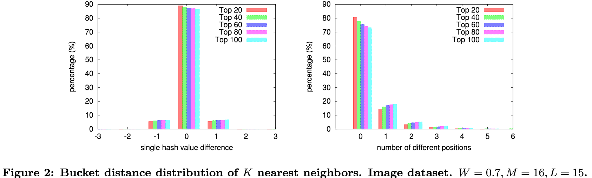
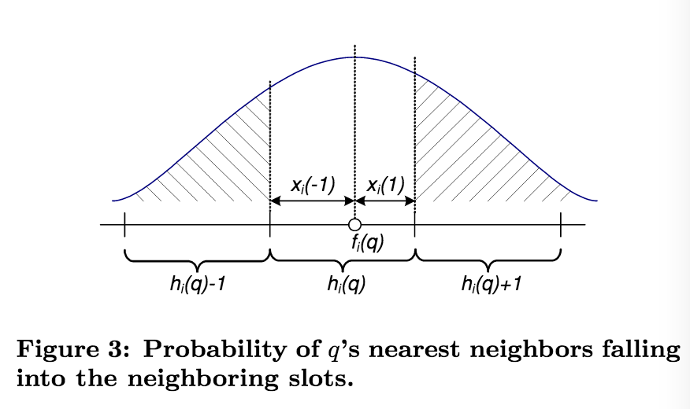
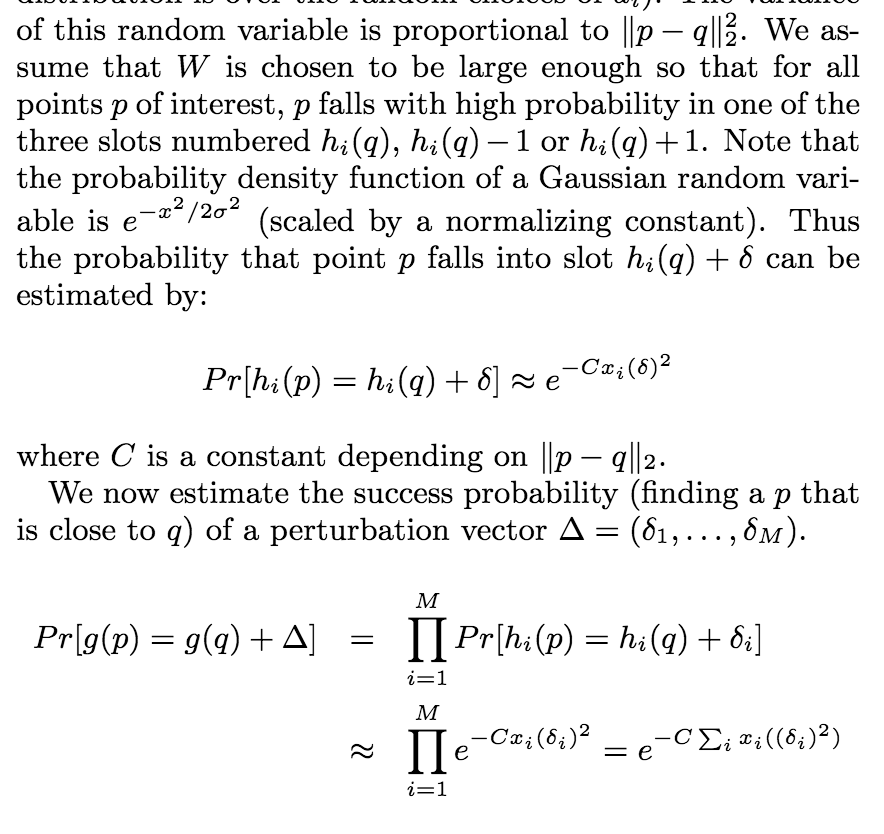
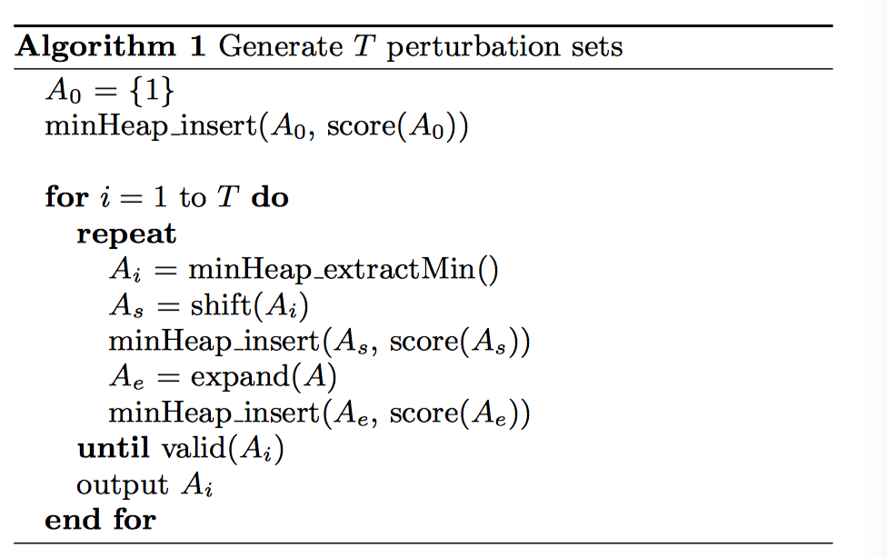
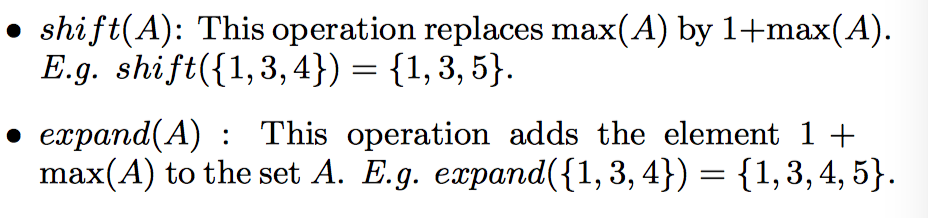

[TOC]

## Definition and Instances

LSH is a randomized hasing framework for efficient approximate neasrest negibot search in high dimensional space.

It is based on the definition of LSH family $\mathcal{H}$, a family of hash functions mapping similar input items into the same hash code with higher probability than dissimilar items.

LSH aims to maximize the probability of collision of similar items, while tradition hash always avoid collisions.

### The Family

A family $\mathcal{H}$ is $(R, cR, P_1, P_2)$-sensitive if for any two items $p$ and $q$

If $d(p, q)\le R$, then $P(h(p)=h(q))\ge P_1​$

If $d(p, q)\ge cR$, then $P(h(p)=h(q))\le P_2$

Here $c>1$, $P_1>P_2$, $h\in\mathcal{H}$

Define $\rho=\frac{\log P_1}{\log P_2}$, then there exists an algorithm for (R, C)-near neighbor problem which uses $O(dn+n^{1+\rho})$ space, with query time dominated by $O(n^{\rho})$ distance computations and $O(n^{\rho}\log_{1/P_2}n)$ evaluations of hash functions. [^fn1]

[^fn1]: Localitysensitive hashing scheme based on p-stable distributions.

Define $g(x)=(h_1(x), ...., h_K(x))$, the output of $g$ identifies a hash bucket id.

However, the compound hash function also reduce the probability of collsion of smiliar items.

To improve the recall, $L$ such compund hash function are sampled independently, each of which corresponds to a hash table.

To improve precision, K should be large.

To improve recall, L should be large.

The items lying in the L hash buckets are retrieved as near item candidates.

### $l_p$ Distance

### Angle-Based Distance

### Hamming Distance

### Jaccard Coefficient

### $\mathcal{X}^2$ Distance

### Rank Similarity

### Shift Invariant Kernels

### Non-Metric Distance

### Arbitrary Distance Measures

## Search, Modeling and Analyzing

### Search

#### Entropy-based search

#### LSH forest

#### Adaptative LSH

#### Multi-Probe LSH [^multi-probe-lsh]

Given a query $q$, the basic LSH query $g(q)=(h_1(q), ..., h_M(q))$, while multi-probe LSH probes $g(q)+\Delta$. $\Delta=(\delta_1, ..., \delta_M), \delta_i\in\{-1, 0, 1\}$, since similar objects should hash to the same or adjacent buckets with high probability. A approriate pertubation sequence will make multi-probe LSH achieves similar recall with less hash tables and similar time complexity.

##### Step-Wise Probing Sequence

Firstly probe the 1-step buckets, then all the 2-step buckets, and so on.

The total number of all $n$-step buckets is $L\times {M\choose n}\times2^n$.

##### Query-Directed Probing Sequence

Using the step-wise probing method, all coordinates in the hash values are treated identically. And the probability of adding 1 and substracting 1 from each coordinate is equal as well.

Consider the hash function $h(q)=\lfloor\frac{a\cdot q+b}{W}\rfloor$.

Let $x_i(\delta)$ ne the distance of $q$ from the boundary of the slot $h_i(q)+\delta$, then $x_i(-1)=f_i(q)-W\cdot f_i(q)$, where $f_i(q)=a\cdot q + b$. $x_i(1)=W-x_i(-1)$. And we define $x(0)=0$

For any fixed point $p$, $f_i(p)-f_i(q)$ is a Gaussian random variable ($a$ is a sampled from a standard Gaussian), with 0 mean, and the variance is $||p-q||_2^2$.

Then it indicates that $score(\Delta)=\sum_{i=1}^{M}x_i(\delta_i)^2$. Pertutation vector with smaller score should have higher probability of yielding points near to $q$.

Then we firstly calculate $x_i(\delta), i=1, 2, ..., M, \delta\in\{-1,1\}$. We sort these $2M$ valus in increasing order. Let $z_j$ denote the $j$th element in this sorted order.

Let $\pi_j=(i, \delta)$ if $z_j=x_i(\delta)$. Since $x_i(-1)+x_i(1)=W$, if $\pi_j=(i, \delta)$, then $\pi_{2M+1-j}=(i, -\delta)$.

Then the problem reduces to the problem of generating perturbation sets in increasing order of their scores.

##### Optimized Probing Sequence Construction

To avoid the overhead of maintaining the querying such a heap at query time, we precompute a certain sequence and reduce the generation of pertibation vectors to performing lookups instead of heap queries and updates.

We approximate the $z_j^2$ values by their expectations.

Note that $x_i(\delta)$ is uniformly distributed in $[0, W]$, and $x_i(\delta)+x_i(-\delta)=W$.

The joint distribution of $z_j$ for $j=1,2,...,M$ is the following: pick $M$ numbers uniformaly and at random from $[0, \frac{W}{2}]$. $z_j$ is the $j$-th largest nuber in this set. This is a well studied distribution.
$$
E[z_j]=\frac{j}{2(M+1)}W\\
E[z_j^2]=\frac{j(j+1)}{4(M+1)(M+2)}W^2
$$

[^multi-probe-lsh]: Q. Lv, W. Josephson, Z. Wang, M. Charikar, and K. Li. Multiprobe lsh: Efficient indexing for high-dimensional similarity search. In VLDB, pages 950–961, 2007. 3, 8

#### Dynamic Collision Counting for Search [^c2lsh]

Use dynamic compound hash function rather than a static one.

C2LSH firstly randomly chooses a set of $m$ LSDH functions with appropriately small interval $W$, which form a function base $\mathcal{B}$.

Only data objects with large enough collison counts need to have their distances computed.

##### Collision Number and Frequent Object

A data object is called frequence if its collision number #collision(o) is greater than or equal to a pre-specified collision threshold l.

##### LSH Functions for C2LSH

Level-1: $h(o)=\lfloor\frac{\vec a \cdot \vec o + b^*}{W}\rfloor$, it is $(1, c, p_1, p_2)$ sensitive.

Level-R hash function: $h^R(o)=\lfloor\frac{h(o)}{R}\rfloor$, it is $(R, cR, p_1, p_2)$-sensitive

An objects o's level-R bucket identified by the level-R bid, consists of R consecutive level-1 buckets identified by the level-1 bids.

##### C2LSH for $(R, c)$-NN Search

Fristly calculate the buckets that $q$ falls in by $h_i(q), i=1,2,...,m$, and find the objects collides with $q$.

Then 

[^c2lsh]: Gan, Junhao, et al. "Locality-sensitive hashing scheme based on dynamic collision counting." *Proceedings of the 2012 ACM SIGMOD International Conference on Management of Data*. ACM, 2012.

#### Bayesian LSH

#### Fast LSH

#### Bi-Level LSH

### SortingKeys-LSH

### Analysis and Modeling

