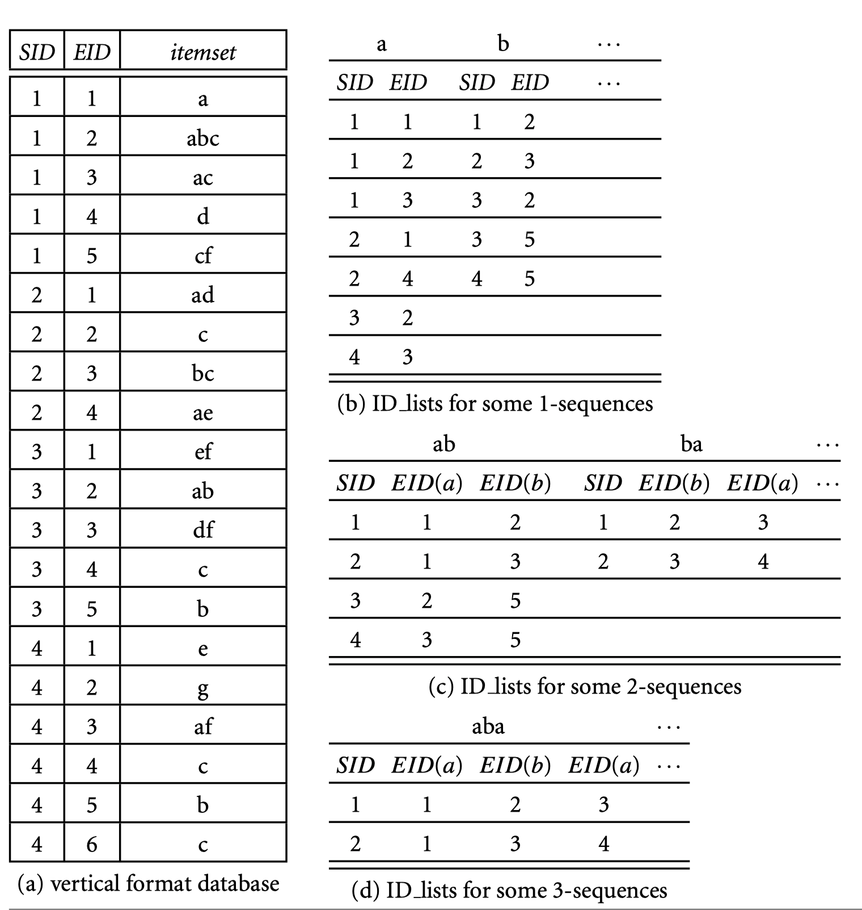

# Sequential Pattern Mining

## Sequence

A sequence is an ordered list of itemsets.

$\alpha$ is called a subseuquence of $\beta$, denoted as $\alpha \subseteq \beta$, if there exist indices $1\le j_1 \le j_2 \le ... \le j_n\le m$, such that $\alpha_1 \subseteq b_{j_1}, ...., a_n\subseteq b_{j_n}$.

| SID  | Sequence                                |
| ---- | --------------------------------------- |
| 1    | <{a}, {**a,b**,c},{a,**c**},{d}, {c,f}> |
| 2    | <{a,d},{c},{b,c},{a,e}>                 |
| 3    | <{e,f},{**a,b**},{d,f},{**c**},{b}>     |
| 4    | <{e},{g},{a,f},{c},{b},{c}>             |

Then <{a,b}, {c}> is a sequential pattern with support=2.

## Mining Algorithms

-   Apriori-Based Algorithms
    -   GSP
    -   SPADE
-   Pattern-Growth-Based Approaches
    -   FreeSpan
    -   PrefixSpan

### The Apriori Property

If a sequence is not frequent, then none of its super-sequence can be frequent.

### GSP

[reference](http://simpledatamining.blogspot.com/2015/03/generalized-sequential-pattern-gsp.html)

1.  Initialize candidates with all length-1 itemset. Set k = 1.
2.  Scan the databse once, count supports for all length-k candidates. Prune these candidates with a minimum support threshold.
3.  Generate length-(k+1) candidates.
    We remove the first and last item from each length-k candidates.
    If any two candiates' -1st and -last match, them we join them.
    
4.  k=k+1. Goto 2.

### SPADE

As GSP, SPADE also generates candidates and test their supports, but SPADE uses vertical sequence format.

The advantage of vertical format is that it is easy to count support for new candidates.

For example, \<ab\> is a new sequence generated by \<a\> and \<b\>, then we can get the support of \<ab\> joining the representations of \<a\> and \<b\>.

### PrefixSpan

Prefix and suffix.

### CloSpan

