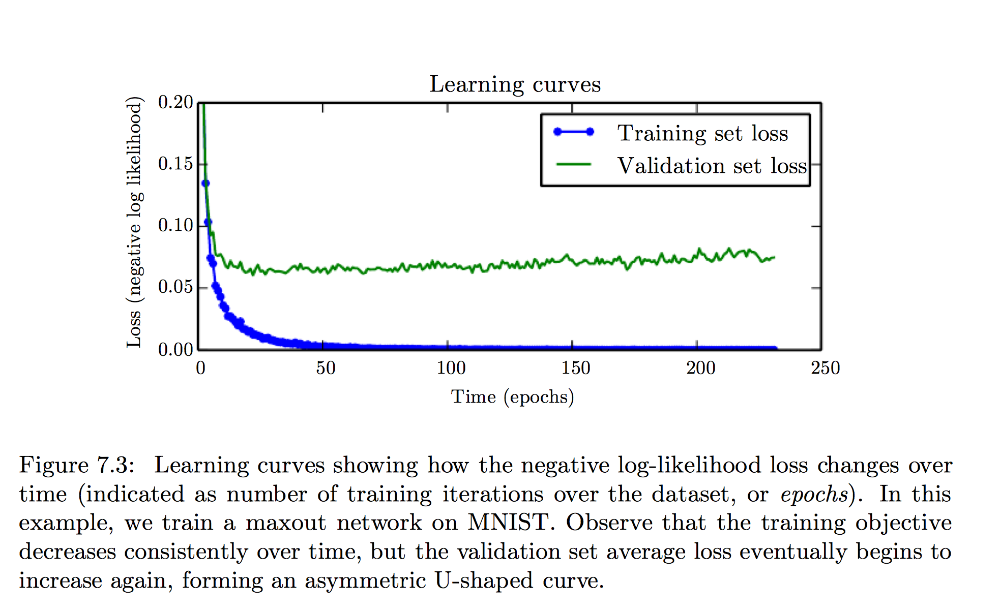
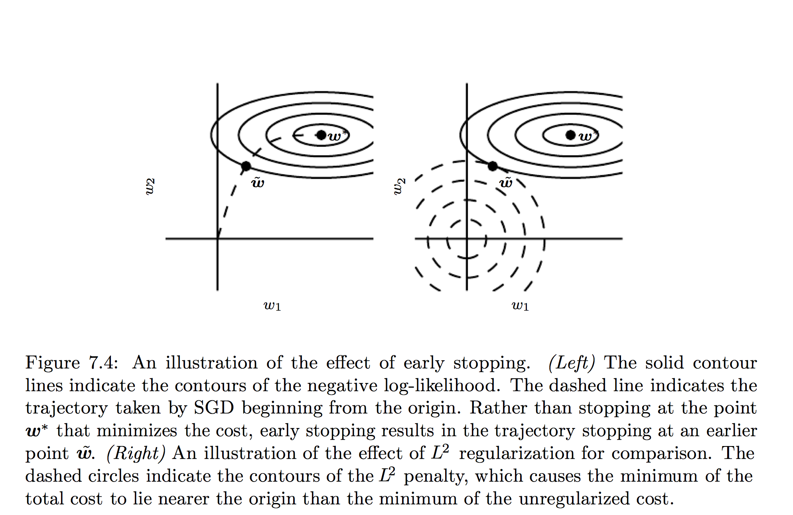
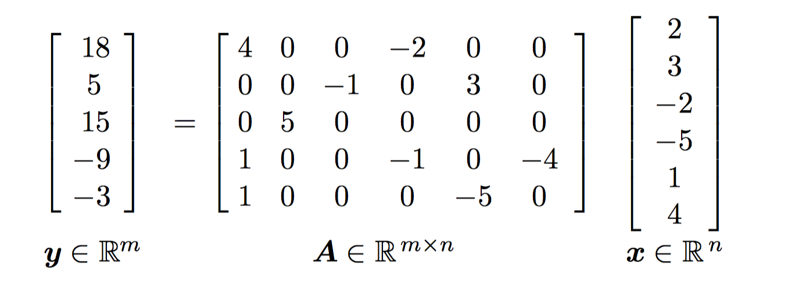
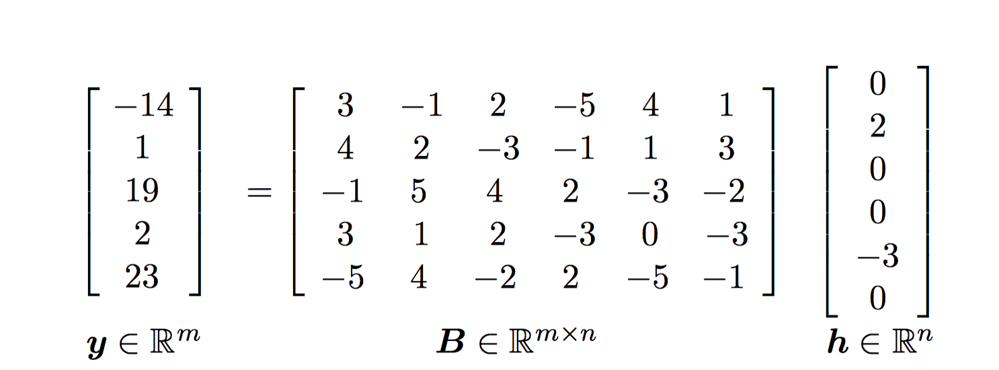

# Regularization

## Paramter Norm Penalties

### L2 Norm

L2正则化也被称为ridge回归或者Tikhonov回归

假设参数只有权重$\boldsymbol{w}$，正则化系数为$\alpha$，则


$$
\newcommand{\vv}[1]{\boldsymbol{#1}}
\hat{J}=J+\frac{1}{2}\alpha \vv{w}^\top\vv{w} \\
\nabla{\hat{J}}=\nabla{J}+\alpha \vv{w}
$$
$$
\vv{w}\leftarrow \vv{w}-\epsilon (\alpha \vv{w}+\nabla J) \\
\Leftrightarrow \vv{w} \leftarrow (1-\epsilon \alpha) \vv{w} - \epsilon \nabla{J}
$$



L2正则化可以看成MAP Bayesian Estimation。

假设损失函数$J(\vv{\theta}|\vv{X},\vv{Y})$为最大似然估计MLE($-\log P_\text{model}(\vv{\theta}|\vv{X},\vv{Y})$)，则在MAP中，若假设参数的先验分布为
$$
\vv{\theta}\sim\mathcal{N}(\vv{0}, \frac{1}{\alpha}\mathbf{I})
$$
则MAP估计得到损失函数为
$$
\hat{J}=-\log{P_\text{model}(\vv{\theta}|\vv{X},\vv{Y})}-\log{P(\vv{\theta})}\\
=J+\alpha \vv{\theta}^\top\vv{\theta}
$$

---

我们考虑一个简单的情况，损失函数是连续的二次函数，泰勒展开三阶及以上余项为0
$$
\vv{w}^*=\text{argmin}_\vv{w} J(\vv{w})\\
\Rightarrow J(\vv{w})=J(\vv{w}^*)+\frac{1}{2}(\vv{w}-\vv{w}^*)^\top\mathbf{H}(\vv{w}-\vv{w}^*)\\
\Rightarrow \nabla \hat J=\mathbf{H}(\vv{w}-\vv{w}^*)+\alpha\vv{w}
$$
此时损失函数$\hat J$的最优解应满足
$$
\tilde{\vv{w}}=(\mathbf{H}+\alpha\mathbf{I})^{-1}\mathbf{H}\vv{w}^*
$$
将$\mathbf{H}$做正交对角化，得到
$$
\tilde{\vv{w}}=\mathbf{Q}(\mathbf{\Lambda}+\alpha\mathbf{I})^{-1}\mathbf{\Lambda}\mathbf{Q}^\top\vv{w}^*
$$
考虑上式系数矩阵的特征值,$\tilde{\lambda_i}=\frac{\lambda_i}{\lambda_i+\alpha}$，我们发现特征值比较大的方向上，基本没有变化；特征值比较小的方向，则权重会减小。

考虑最简单的情况，线性拟合，使用均方误差，则$\vv{w}$有最优解：
$$
J=(\mathbf{X}\vv{w}-\vv{y})^\top(\mathbf{X}\vv{w}-\vv{y}) \\
\hat J = (\mathbf{X}\vv{w}-\vv{y})^\top(\mathbf{X}\vv{w}-\vv{y})+\frac{1}{2}\alpha\vv{w}^\top\vv{w}
$$

此时的最优解分别为
$$
\boldsymbol w=(\mathbf{X}\mathbf{X}^\top)^{-1}\mathbf{X}^\top\boldsymbol w \\
\hat{\boldsymbol w}=(\mathbf{X}\mathbf{X}^\top + \alpha \mathbf{I})^{-1}\mathbf{X}^\top\boldsymbol w
$$

### L1 Norm

## Norm Penalties as constrained optimazation

将有范数惩罚项的优化目标看作有约束的最优化问题。

## Regularization and under-constrained problems

## Dataset augmentation

通过数据增强增加泛化性能。

对于神经网络，数据增强有着特别重要的意义。数据增强的一种方式就是对输入数据加入随机噪声。Dropout可以看作是一种数据增强方法。

## Noise Robustness

一般加入噪声比只是约束参数的大小效果更好，尤其是在隐藏层加入噪声。

另一种正则化模型的方法是给权重增加噪声。这对应的是模型权重的不确定性。

给权重增加噪声可以使模型找到对权重变化不敏感的极小点。

一些数据集label有错误。为了避免这种危害，可以直接对label的不确定性建模。

比如在多分类问题中，softmax输出层的目标是0-1。可以设定一个label错误的概率$\epsilon$，将目标改为$(\frac{\epsilon}{k})$-$(1-\frac{\epsilon}{k-1})$

当目标是0-1的时候，softmax永远不可能学习到0-1，模型永远不会收敛，此时参数只是无限制地增大。我们也可以用其他正则化的方式，比如weight decay解决这个问题。

## Semi-Supervised Learning

## Multi-Task Learning

## Early Stopping

Early stopping可以看作是一种选择超参"训练时间"的方法

使用验证集会导致有一部分训练集无法被模型使用。这时可以重新使用整个数据集进行训练。

Early stopping的正则化作用机制是限制了参数的变化范围

以线性回归为例，在适当的条件下early stopping和L2 norm regularization是等价的。

但是early stopping相比weight decay有着不需要调整超参，只需要根据验证集上的误差就足够了。

## Parameter Trying，Parameter Sharing

有时我们会希望限制模型中的参数互相之间比较接近。

一种方式是加入显式的约束。$\alpha ||\boldsymbol w_a - \boldsymbol w_b||_2$。

实际上可以直接让这样的参数相等，这种方法就是parameter sharing。parameter sharing可以只存储一份参数，减少了内存开销。

CNN就是parameter sharing的例子。

## Sparse Represetations

参数的L1正则化会形成稀疏的模型：

而这里我们希望得到稀疏的表示：

可以仿照参数的L1正则化：
$$
\tilde J=J+\alpha \Omega(\boldsymbol h)
$$
或者使用orthogonal matching pursuit （OMP）显式地限制$\boldsymbol h$为稀疏的：
$$
\text{argmin}_{\boldsymbol h, ||\boldsymbol h||_0 < k} ||\boldsymbol x - \mathbf{W} \boldsymbol h||_2
$$

## Bagging and Other Ensemble Method

>   Bagging (short for bootstrap aggregating) is a technique for reducing generalization error by combining several models

>   on average, the ensemble
>
>   will perform at least as well as any of its members, and if the members make
>
>   independent errors, the ensemble will perform significantly better than its members

## Dropout

Dropout的两种approximate方法：metro carlo，直接使用全部单元。后者计算开销几乎没有，但是性能两者在不同的问题互有上下。

>   One of the key insights of dropout is that training a network with stochastic
>
>   behavior and making predictions by averaging over multiple stochastic decisions
>
>   implements a form of bagging with parameter sharing

对模型的随机改变并不局限于随机丢弃某些单元。例如将权重乘以一个随机变量也是有效的。

Dropout的另一个作用：

>   This means each hidden unit must be able to perform well regardless of which other hidden units are in the model
>
>   Dropout thus regularizes each hidden unit to be not merely a good feature but a feature that is good in many contexts
>

## Advertisial Training

## Tangent Distance, Tangent Prop, and Manifold Tangent Classifier

