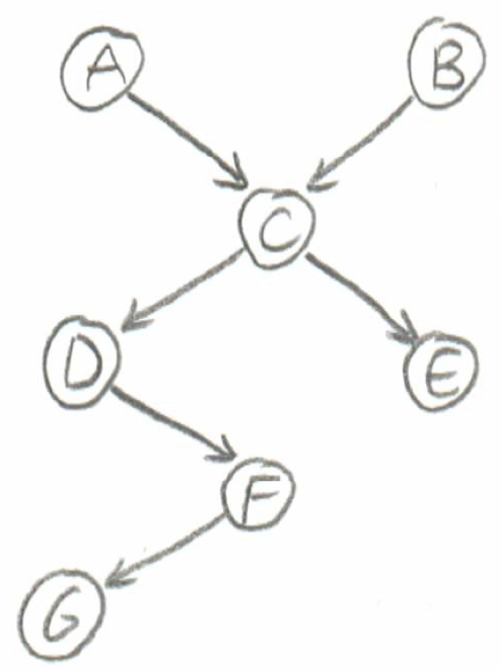
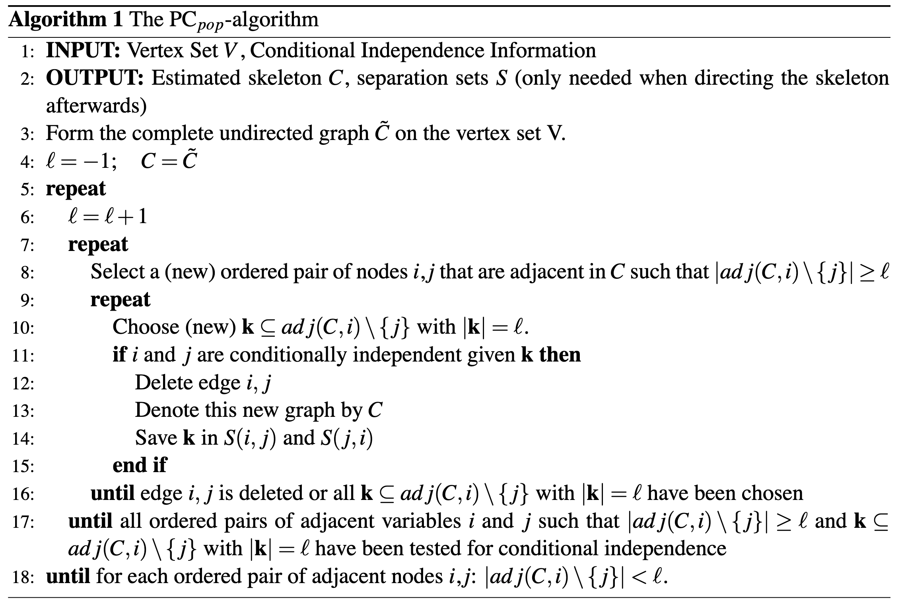

# PC Algorithm

## Find the Equivalence Class of a DAG

### Concepts and Notations

#### Faithfulness[^jmlr2005]

A probability distribution $P$ is said to be faithful with respect to a graph $G$, if conditional independencies of the distribution can be inferred from **d-seperation** in the graph $G$ and vice-visa. More precisely, consider a random vector $\mathbf{X}\sim P$. Faithfulness of $P$ with respect to $G$ means, for any $i\ne j\in V$ and any set $\mathbf{s}\in V$,

$$
\mathbf{X}^{(i)}\bot \mathbf{X}^{(j)}\ \text{given} \ \mathbf{s}
\\\leftrightarrow\\
i\ \text{and}\ j \text{are d-seperated by the set}\ s
$$

 

#### D-Seperation[^mit6.034]

The Bayes net assumption says, "each variable is conditionally independent of its non-descendants, given its parents".

D-seperation is a formal procedure using this statement.

1.  Draw the ancestral graph.

2.  For each pair of variables with a common child, draw a undirected edge between them.

3.  Replace directed edges with undirected edges.

4.  Delete the givens and their edges.

5.  If the variables are disconnected, or one or more are missing, they are guaranteed to be independent. 'Connected' means there is a path between them, even though they are not directly connected:

    Example:

A and B are not independent given D and F.

A and B are marginally independent. 

A and B are not independent given C.

D and E are independent given C.

D and E are not marginally independent.

D and E are not independent given A and B.

#### Skeleton and V-Struture

The skeleton of a DAG $G$ is the undirected graph obtained from $G$ by substudting undirected edges for directed edges.

A v-structure is an ordered triple $(i, j, k)$ such that $G$ contains $i\to j$ and $j\to k$ but no $i\to k$.

#### Equivalent

Two DAG are equilavent if and only if they have the same skeleton and the san v-structures.

### Find The Skeleton Using PC Algorithm[^jmlr2005]

Consider a DAG $G$ and assume that the distribution $P$ is faithful to $G$. Denote the maximal number of neighbors by $q=\max_{1\le j\le p}|adj(G, j)|$ 

[^jmlr2005]: Kalisch, Markus, and Peter Bühlmann. "Estimating high-dimensional directed acyclic graphs with the PC-algorithm." *Journal of Machine Learning Research* 8.Mar (2007): 613-636.
[^mit6.034]: http://web.mit.edu/jmn/www/6.034/d-separation.pdf