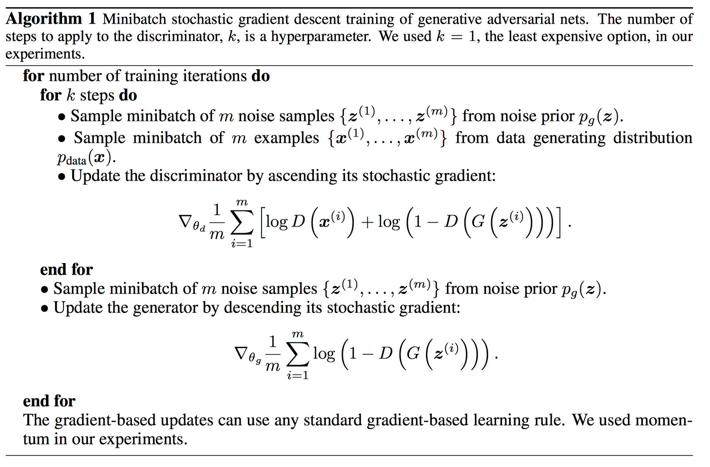

## GAN

*Goodfellow, Pouget-Abadie and in neural …, M. 2014. Generative adversarial nets. (2014).*

---

$$
V(G,D)=\mathbb{E}_{\boldsymbol x \sim p_\text{data}({\boldsymbol x})}[\log D(\boldsymbol x)] + \mathbb{E}_{\boldsymbol z\sim p_\boldsymbol z(\boldsymbol z)}[\log(1-D(G(z)))]
$$

Training objective: 
$$
\min_G \max_D V(G, D)
$$

For any $G$, optimal D is $D_G^*=\frac{p_{data}}{p_{data}+p_g}$

Since $V(G,D)=\int p_{data}(\boldsymbol x)\log D(\boldsymbol x)+p_g(\boldsymbol x)\log (1 - D(\boldsymbol x)) d\boldsymbol x$

Then
$$
C(G)=V(G, D_G^*)=\mathbb{E}_{\boldsymbol x\sim p_{data}}[\log\frac{p_{data}}{p_{data}+p_g}]+\mathbb{E}_{\boldsymbol x \sim p_g}[\log\frac{p_g}{p_{data}+p_g}]
$$
The global optimal for $V(G)$ is $p_g^*=p_{data}$

Since $C(G^*)=-\log4$, and 
$$
C(G)=-\log4+\mathbb{KL}[p_{data}||\frac{p_{data}+p_g}{2}]+\mathbb{KL}[p_g||\frac{p_{data}+p_g}{2}]\\
=-\log4+2\cdot JSD(p_{data}||p_g)
$$

Convergence:

>   If G and D have enough capacity, and at each step of Algorithm 1, the discriminator is allowed to reach its optimum given G, and p g is updated so as to improve the criterion $C(G)$ then $p_g$ converges to $p_{data}$

Saturates:

>   In practice, $V(G, D)$ may not provide sufficient gradient for $G$ to learn well. Early in learning, when $G$ is poor, $D$ can reject samples with high confidence because they are clearly different from the training data. In this case, $\log(1 − D(G(\boldsymbol z)))$ saturates. Rather than training $G$ to minimize $\log(1 − D(G(\boldsymbol z)))$ we can train $G$ to maximize $\log D(G(\boldsymbol z))$. This objective function results in the same fixed point of the dynamics of $G$ and $D$ but provides much stronger gradients early in learning.

Training algorithm:

## WGAN

