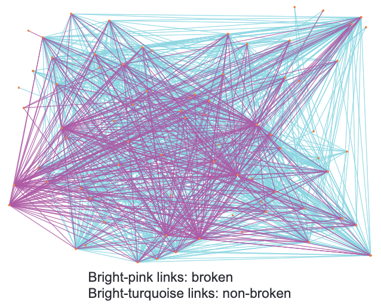
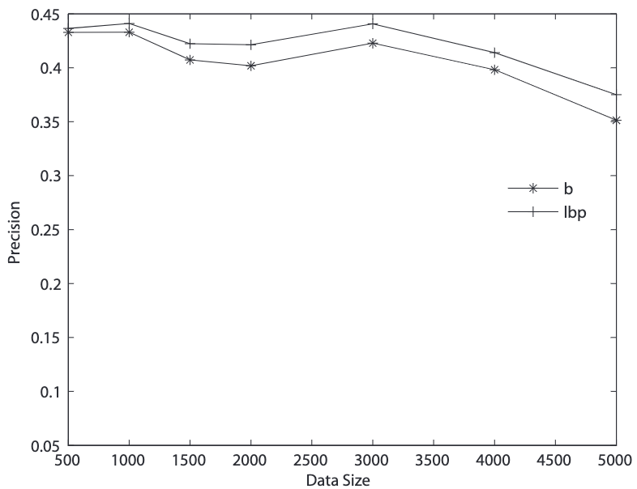
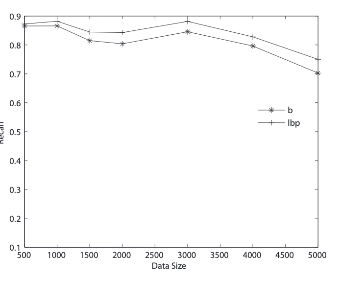
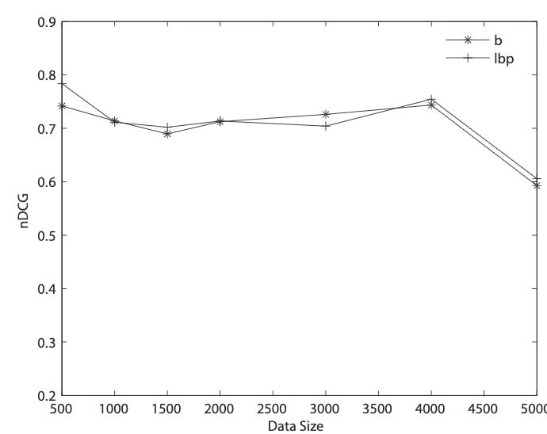
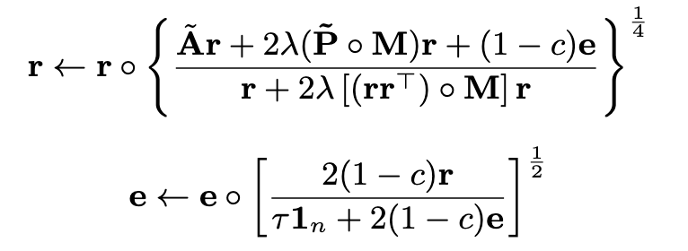

# Network Diffusion

[TOC]

## Invariant Network

假设有N条时间序列，这N条时间序列之间的相关关系称为invariant link。这样的有invariant link的graph就称为invariant network。

具体的做法是用ARX模型[^tkde2007]。给定两个时间序列$x(t), y(t)$。若将$x$作为输入，那么记
$$
\phi(t)=[-y(t-1),...,-y(t-n),x(t-k),...,x(t-k-m)]^\top\\
\theta = [a_1,...,a_n,b_0,...,b_m]^\top
$$
模型定义为$\hat{y}(t)=\phi(t)^\top\theta$。

通过最小化MSE得，$\theta$的解为
$$
\hat{\theta}_N=[\sum_{t=1}^{N}\phi(t)\phi(t)^\top]^{-1}\sum_{t=1}^{N}\phi(t)y(t)
$$
定义fitness score为
$$
F(\theta)=1 - \sqrt{\frac{\sum_{t=1}^{N}|y(t)-\hat{y}(t)|^2}{\sum_{t=1}^{N}|y(t)-\bar{y}|^2}}
$$
如果$F(\theta)$超过一个给定的阈值，那么就认为两个模型之间有相关关系。

但是给定一组$x, y$，我们无法事先确定哪个是输入哪个是输出。[^tkde2007]中的方法是选择$F(\theta)$较高的那一个，但是同时要求两个模型的fitness score都比较高。

## Broken Links

当系统发生异常时，组件之间的invariant link常常会发生变化。消失的invariant link就被称为broken link。

通过检测哪些组件导致了broken link可以引导运维人员找到故障的根因。

## MRF Model

### Algorithm

MRF（Markov random field）模型可以用来建模invariant network和borken network[^icdm2014]。

MRF包含若干个变量，每个变量有隐状态和显状态，隐状态之间有互相的连接。

每个包含至少一条broken link的节点是MRF中的一个变量，broken link是变量之间的连接。其observed state是我们对每个节点的根因程度的直接观察。具体的定义可以为
$$
RB_{v_i}=\frac{number\>of\>borken\>links\>of\>v_i}{number\>of\>all\>links\>of\>v_i}\\
RUB_{v_i}=1-\frac{number\>of\>broken\>links\>related\>to\>BINN}{number\>of\>all\>links\>related\>to\>BINN}
$$
BINN指的是节点的通过broken link连接起来的邻居

RB被用来作为隐状态的初始值，RUB作为显状态[^icdm2014]。

node compatibility function定义为
$$
\Phi(\lambda, \omega)=\begin{cases}\omega & \lambda=abnormal\\1-\omega & \lambda =normal\end{cases}
$$
每个节点是根因的belief，$b(\lambda)$为：
$$
b_i(\lambda)=k\Phi(\lambda, \omega_i)\prod_{j\in N(i)}m_{ji}(\lambda)
$$
$m_{ji}(\lambda)$表示邻居$j$认为$i$处于状态$\lambda$的belief
$$
m_{ij}(\lambda)=\sum_{\lambda'}\Phi(\lambda,\omega_i)\Psi(\lambda,\lambda')\prod_{n\in N(i)/j}m_{ni}(\lambda')
$$
其中$\Psi(\lambda,\lambda')$表示edge compatibility function。

|          | normal                 | abnormal       |
| -------- | ---------------------- | -------------- |
| normal   | $\epsilon_0$ (很小)    | $1-\epsilon_0$ |
| abnormal | $\epsilon$ （小于0.5） | $1-\epsilon$   |

这样的message passing的方法被称为loopy BP[^icdm2014]。

### Evaluation

~[^icdm2014]中只把MRF model和直接用RB给节点排序的方法进行了对比。评价指标是top-k precision，top-k recall，和nDCG。

- Top-k precision and recall. k一般选择ground truth set大小的两倍 [^dcg]。
- nDCG （cumulated gain vector with discount, [^dcg]）：表征top-p的排序结果。p一半比ground truth set略小。
$$
nDCG=\frac{DCG}{IDDCG}
$$
$$
DCG_p=\sum_{i=1}^{p}\frac{2^{rel_i-1}}{\log_2{1+i}}
$$
​	$rel_i$是第i名在ground truth中的名次。IDCG是ground truth的DCG

但是从结果看来，LBP比直接用RB并不好太多。Benchmark是人工生成的。

## Label Propagation and Network Diffusion[^kdd2016]
### Algorithm

$\mathbf{A}_{n\times n}$, $\mathbf{P}_{n\times n}$是原本的IN和broken IN的邻接矩阵。$\mathbf{A}$的元素表示两个节点之间的相关性，比如fitness score。$\mathbf{P}$的元素表示两个节点之间的不相关性，比如residual。

故障传播模型指的是，给定每个节点是否（根因）异常的$\mathbf{e}$，计算在IN上故障传播后每个节点的故障程度$\mathbf{r}$。 

基本的假设是，故障沿着相关传播，$\mathbf{A}_{ij}$越大（根据度normalized之后），那么关联的两个节点之间的$\mathbf{r}_i, \mathbf{r}_j$就应该越接近。即$\mathbf{r}$在IN上是平滑的。 

另一个假设是$\mathbf{e}$和$\mathbf{r}$之间要尽量接近。 
$$
\min_{\mathbf{r}\ge 0}c\mathbf{r}^\top(\mathbf{1}-\tilde{\mathbf{A}})\mathbf{r}+(1-c)||\mathbf{r}-\mathbf{e}||_2^2
$$

Network diffusion指的是衡量根因重构出来的broken IN和真实的broken IN的差别。
$$
\min_{\mathbf{e}\in \{0, 1\}^N}\>\lambda||(\mathbf{r}\mathbf{r}^\top)\odot\mathbf{M}-\tilde{\mathbf{P}}||_2^2 + c\mathbf{r}^\top(\mathbf{1}-\tilde{\mathbf{A}})\mathbf{r}+(1-c)||\mathbf{r}-\mathbf{e}||_2^2
$$
松弛形式
$$
\min_{\mathbf{e}\ge0}\>\lambda||(\mathbf{r}\mathbf{r}^\top)\odot\mathbf{M}-\tilde{\mathbf{P}}||_2^2 + c\mathbf{r}^\top(\mathbf{1}-\tilde{\mathbf{A}})\mathbf{r}+(1-c)||\mathbf{r}-\mathbf{e}||_2^2 + \tau||\mathbf{e}||_1
$$
上述优化问题的迭代解法参考了[^kdd2006]

### Evaluation

同样是在人工随机生成的500条time series上进行的实验。评价指标仍然是top-k precision，top-k recall和nDCG。

除此之外还随机注入了broken link作为噪声，检验robustness。实验表明噪声比例多至0.5时性能才会有明显下降。

## Multiple Root Cause

考虑到invariant network中会有不同的cluster，故障是在cluster内传播的。同时系统中可能有多个cluster同时发生了故障。因此[^icdm2017]提出了基于聚类的故障定位方法CRD。

### Algorithm

定义矩阵 $\mathbf{U}_{n\times k}$为cluster membership矩阵，$\mathbf{U}_{xi}=p(i|x)， \mathbf{U}\mathbf{1}_{k}=\mathbf{1}_n$。

首先要使用正常的IN进行聚类。

通过doubly schchastic matrix decomposition方法计算$\mathbf{U}$。

首先计算重构的邻接矩阵$\hat{A}$。$\hat{A}_{xy}=\sum_{i=1}^{k}\frac{\mathbf{U_{xi}\mathbf{U}_{yi}}}{\sum_{z=1}^n\mathbf{U}_{zi}}$

然后优化$A$和$\hat{A}$的KL散度 $D_{KL}[A||\hat{A}]$

通过给$\mathbf{U}$指定Dirichlet先验，使得可以得到尽量稀疏的$\mathbf{U}$。

然后需要使用broken IN进行聚类。Intuition是如果两个节点在同一个发生故障的cluster中，那么他们之间更可能出现broken link。

定义$E_{xi}=1$表示节点$x$是cluster $i$的根因。仿照

### Evaluation

BIS 

[^tkde2007]: Guofei Jiang, Haifeng Chen, K. Yoshihira. Efficient and Scalable Algorithms for Inferring Likely Invariants in Distributed Systems
[^icdm2014]: Changxia Tao, Yang Ge, Qinbao Song, Yuan Ge, Olufemi A. Omitaomu. Metric Ranking of Invariant Networks with Belief Propagation.
[^kdd2016]: Wei Cheng, Kai Zhang, Haifeng Chen, Guofei Jiang, Zhengzhang Chen, Wei Wang. Ranking Causal Anomalies via Temporal and Dynamical Analysis on Vanishing Correlations
[^kdd2006]: Chris Ding , Tao Li , Wei Peng , Haesun Park, Orthogonal nonnegative matrix t-factorizations for clustering, Proceedings of the 12th ACM SIGKDD international conference on Knowledge discovery and data mining, August 20-23, 2006, Philadelphia, PA, USA
[^icdm2017]: Ranking Causal Anomalies by Modeling Local Propagations on Networked Systems, ICDM 2017