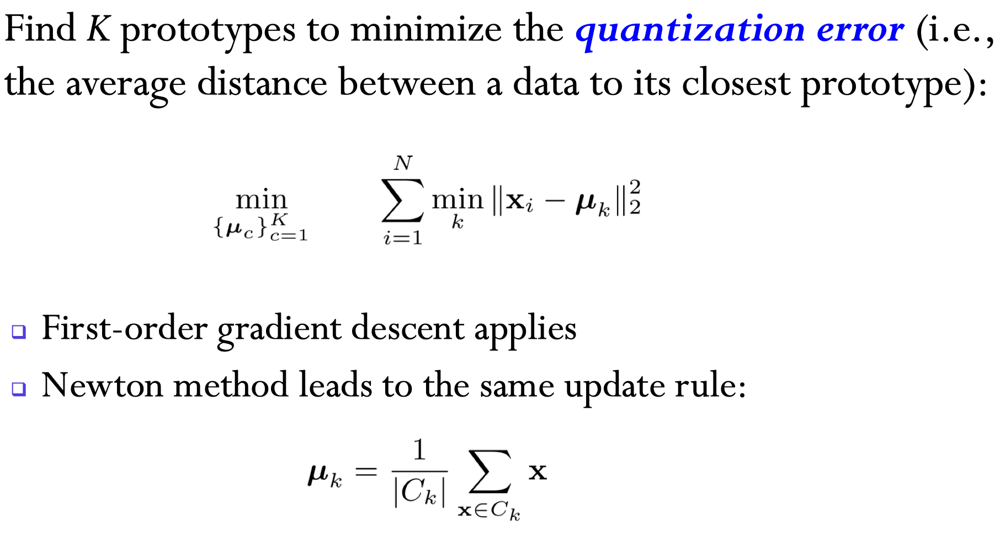

## Clustering

cluster means group objects into classes of similar objects

-   Minimize inter-class similarity
-   Maximize intra-class similarity

### Metric Sapce

What is distance?

1.  $d(x, y) = d(y, x)$
2.  $d(x , y) \ge 0$ and $d(x, y)=0 \Leftrightarrow x = y$
3.  $d(x,y)\le d(x, z) + d(z, y)$

Examples:

-   (distance derived from) $p$-norm 
-   edit distance
-   hamming distance
-   Cosine distance
-   Non-metric distances,  e.g. DTW, perceptual loss

### K-Means

#### Algorithm

1.  Initialize $\mu_1, ..., \mu_K$
2.  Repeat until no change happens
    1.  Expectation: for each $k$, $C_k=\{i\>s.t.\> x_i\text{ is closest to }\mu_k\}$
    2.  Maximization: for each $k$, update $\mu_k=\frac{1}{|C_k|}\sum_{i\in C_k}x_i$

#### Optimization problem

$$
J=\sum_{n=1}^{N}\sum_{k=1}^{K}r_{nk}||x_n-\mu_k||^2 \\
s.t. \>\> \sum_{k=1}^{K}r_{nk}=1, r_{nk}\in\{0, 1\}\\
\mu_k=\frac{\sum_ix_i1_{r_{nk}=1}}{\sum_i1_{r_{nk}=1}}
$$

In each expection step, we keep $\mu_k$ fixed and optimize $J$ with respect to $r_{nk}$
It has closed form solution:
$$r_{nk}=\begin{cases}1 & k=\text{argmin}_i ||x_n-\mu_i||^2 \\ 0 & otherwise\end{cases}$$​	

In each maimization step, we keep $r_{nk}$ fixed and optimize $J$ with respect to $\mu_k$

It has closed form solution:
$$
\because \frac{\partial J}{\partial \mu_k}=\sum_i2 r_{ik} (x_i-\mu_k)=0\\
\therefore \mu_k=\frac{\sum_n x_nr_{nk}}{\sum_n r_{nk}}
$$

#### K-Means as Gradient Descent

Gradient descent can be applied.

Second oder gradient descent leads to the same update rule as k-means.

#### Find a Good Optimum

K-means leads to a local optimum

-   find a good start point
-   Run many times of k-means and choose a best one
-   ....

### Gaussian Mixture

#### Gaussian

MLE for Gaussian leads to natual solutions

#### Gaussian Mixture

$$
p(x)=\sum_{k=1}^{K}\pi_k\mathcal{N}(x|\mu_k, \Sigma_k)\\
p(x|z_k=1)=\mathcal{N}(x|\mu_k, \Sigma_k)\\
p(z)=\prod_{k=1}^{K}\pi_k^{z_k}, \pi_k\in[0, 1], \sum_{k=1}^{K}\pi_k=1
$$

$$
\mathcal{L}=\log p(D)\\
=\sum_{n=1}^{N}\sum_{k=1}^{K}(\log \pi_k - \frac{1}{2}\log (2\pi) - \frac{1}{2}\log |\Sigma_k|-\frac{1}{2}(x-\mu_k)^\top\Sigma_k^{-1}(x-\mu_k))
$$

Before do MLE, let's first take a look at the posterior:
$$
p(z_k=1|x)=\frac{p(x|z_k=1)p(z_k=1)}{p(x)}\\
=\frac{\pi_k\mathcal{N}(x|\mu_k, \Sigma_k)}{\sum_{i=1}^{K}\pi_i\mathcal{N}(x|\mu_i, \Sigma_i)}
$$
Let $\gamma(z_k)=p(z_k=1|x)$

Then
$$
\because \frac{\partial \mathcal L}{\partial \mu_k}=\sum_{n=1}^{N}
$$
