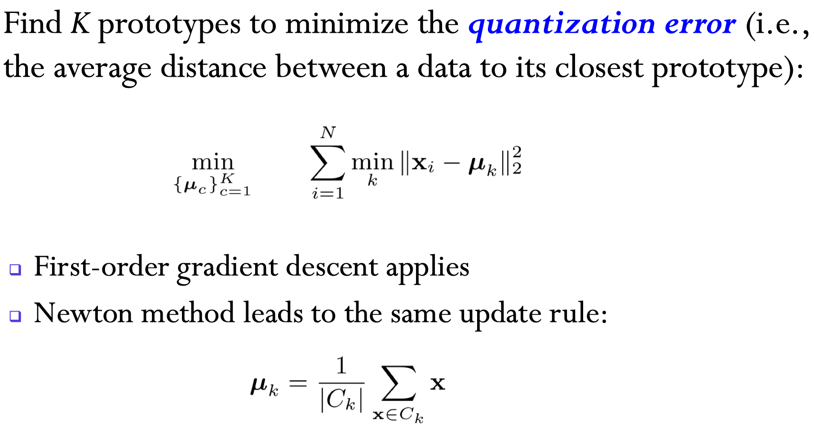
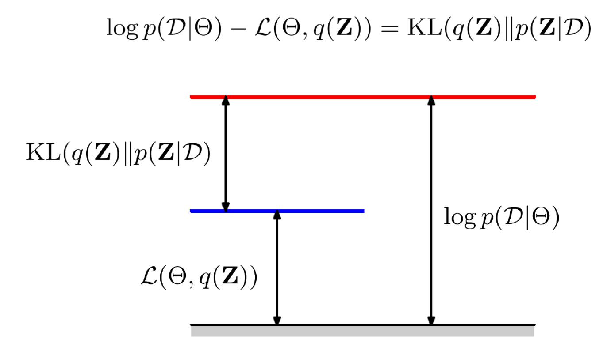
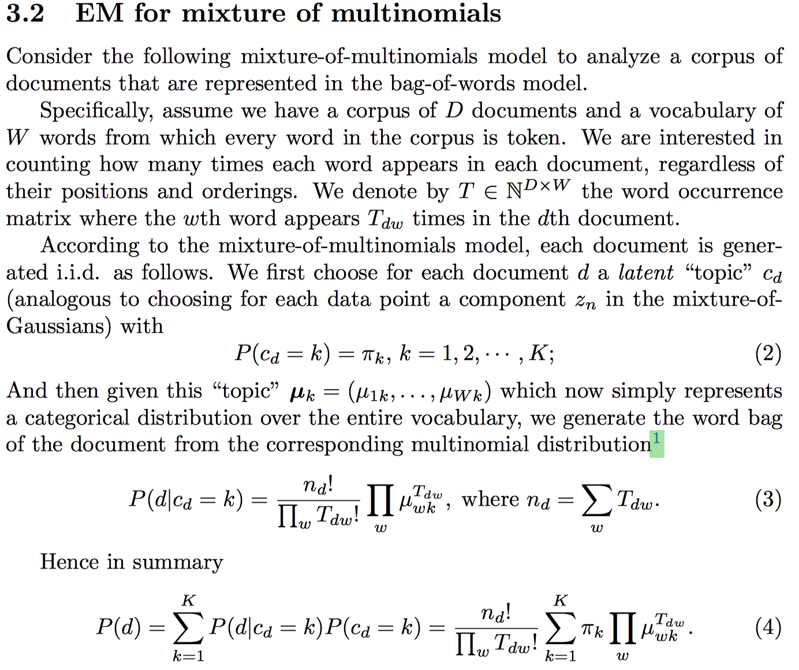

## Clustering

cluster means group objects into classes of similar objects

-   Minimize inter-class similarity
-   Maximize intra-class similarity

### Metric Sapce

What is distance?

1.  $d(x, y) = d(y, x)$
2.  $d(x , y) \ge 0$ and $d(x, y)=0 \Leftrightarrow x = y$
3.  $d(x,y)\le d(x, z) + d(z, y)$

Examples:

-   (distance derived from) $p$-norm 
-   edit distance
-   hamming distance
-   Cosine distance
-   Non-metric distances,  e.g. DTW, perceptual loss

### K-Means

#### Algorithm

1.  Initialize $\mu_1, ..., \mu_K$
2.  Repeat until no change happens
    1.  Expectation: for each $k$, $C_k=\{i\>s.t.\> x_i\text{ is closest to }\mu_k\}$
    2.  Maximization: for each $k$, update $\mu_k=\frac{1}{|C_k|}\sum_{i\in C_k}x_i$

#### Optimization problem

$$
J=\sum_{n=1}^{N}\sum_{k=1}^{K}r_{nk}||x_n-\mu_k||^2 \\
s.t. \>\> \sum_{k=1}^{K}r_{nk}=1, r_{nk}\in\{0, 1\}\\
\mu_k=\frac{\sum_ix_i1_{r_{nk}=1}}{\sum_i1_{r_{nk}=1}}
$$

In each expection step, we keep $\mu_k$ fixed and optimize $J$ with respect to $r_{nk}$
It has closed form solution:
$$r_{nk}=\begin{cases}1 & k=\text{argmin}_i ||x_n-\mu_i||^2 \\ 0 & otherwise\end{cases}$$​	

In each maimization step, we keep $r_{nk}$ fixed and optimize $J$ with respect to $\mu_k$

It has closed form solution:
$$
\because \frac{\partial J}{\partial \mu_k}=\sum_i2 r_{ik} (x_i-\mu_k)=0\\
\therefore \mu_k=\frac{\sum_n x_nr_{nk}}{\sum_n r_{nk}}
$$

#### K-Means as Gradient Descent

s

Gradient descent can be applied.

Second oder gradient descent leads to the same update rule as k-means.

#### Find a Good Optimum

K-means leads to a local optimum

-   find a good start point
-   Run many times of k-means and choose a best one
-   ....

### Gaussian Mixture

#### Gaussian

MLE for Gaussian leads to natual solutions

#### Gaussian Mixture

$$
p(x)=\sum_{k=1}^{K}\pi_k\mathcal{N}(x|\mu_k, \Sigma_k)\\
p(x|z_k=1)=\mathcal{N}(x|\mu_k, \Sigma_k)\\
p(z)=\prod_{k=1}^{K}\pi_k^{z_k}, \pi_k\in[0, 1], \sum_{k=1}^{K}\pi_k=1
$$

$$
\mathcal{L}_0=\log p(D)\\
=\sum_{n=1}^{N}\log(\sum_{k=1}^{K}\pi_k\mathcal N(x|\mu_k, \Sigma_k))
$$

Because of the constraints, we should use Lagrange multiplier method:
$$
\mathcal{L}=\mathcal{L}_0+\lambda(\sum_{k=1}^{K}\pi_k-1)
$$

Before do MLE, let's first take a look at the posterior:
$$
p(z_k=1|x)=\frac{p(x|z_k=1)p(z_k=1)}{p(x)}\\
=\frac{\pi_k\mathcal{N}(x|\mu_k, \Sigma_k)}{\sum_{i=1}^{K}\pi_i\mathcal{N}(x|\mu_i, \Sigma_i)}
$$
Let $\gamma(z_k)=p(z_k=1|x)$

Then
$$
\because \frac{\partial \mathcal L}{\partial \mu_k}
=-\sum_{n=1}^{N}\frac{\pi_k\mathcal N(x_n|\mu_k, \Sigma_k)}{\sum_{j=1}^{K}\pi_j\mathcal{N}(x_n|\mu_j,\Sigma_j)}\cdot \Sigma_k^{-1}(x_n-\mu_k)\\
=\sum_{n=1}^{N}\gamma(z_{nk})\Sigma_k^{-1}(x_n-\mu_k)=0 \\
\therefore \mu_k=\frac{\sum_{n=1}^{N}\gamma(z_{nk})x_n}{\sum_{n=1}^{N}\gamma(z_{nk})}
$$
$\mu$ looks like a weighted mean of $x$, but it is not a closed form solution.

Maximize $\mathcal L$ with respect to $\Sigma$ is difficult, so we optimize it with respect to $\Sigma^{-1}$, which will be denoted as $S$
$$
\nabla_{S}\mathcal{L}=\sum_{n=1}^{N}\frac{\pi_k}{\sum_{i=1}^{K}\pi_i\mathcal N(x_n|\mu_i, \Sigma_i)}\nabla_SN(x_n|\mu_k, \Sigma_k)
$$

$$
\frac{\partial N(x_n|\mu_k, \Sigma_k)}{\partial S}=\frac{\partial N(x_n|\mu_k, \Sigma_k)}{\partial \log N(x_n|\mu_k, \Sigma_k)}\cdot\frac{\partial \log N(x_n|\mu_k, \Sigma_k)}{\partial S}\\
\because \frac{\partial N(x_n|\mu_k, \Sigma_k)}{\partial \log N(x_n|\mu_k, \Sigma_k)}=N(x_n|\mu_k, \Sigma_k) \\
\frac{\partial \log N(x_n|\mu_k, \Sigma_k)}{\partial S}=\frac{1}{2}\frac{\partial \log|S|}{\partial S}-\frac{1}{2}\cdot\frac{\partial (x_n-\mu_k)^\top S (x_n-\mu_k)}{\partial S}\\
=\frac{S^*}{2|S|}-\frac{1}{2}(x_n-\mu_k)(x_n-\mu_k)^\top \\
=\frac{1}{2}(\Sigma_k-(x_n-\mu_k)(x_n-\mu_k)^\top)\\
\therefore \frac{\partial N(x_n|\mu_k, \Sigma_k)}{\partial S}=\frac{1}{2}N(x_n|\mu_k, \Sigma_k)(\Sigma_k-(x_n-\mu_k)(x_n-\mu_k)^\top)
$$

$$
\nabla_{S}\mathcal{L}=\sum_{n=1}^{N}\gamma(z_{nk})(\Sigma_k-(x_n-\mu_k)(x_n-\mu_k)^\top)=0
$$

$$
\Sigma_k=\frac{\sum_{n=1}^{N}\gamma(z_{nk})(x_n-\mu_k)(x_n-\mu_k)^\top}{\sum_{n=1}^{N}\gamma(z_{nk})}
$$

$$
\because \nabla_{\pi_k}\mathcal{L}=\sum_{n=1}^{N}\frac{N(x_n|\mu_k, \Sigma_k)}{\sum_{i=1}^{K}\pi_i\mathcal N(x_n|\mu_i, \Sigma_i)}+\lambda=0 \\
\therefore \lambda\sum_{i=1}^{K}(\pi_k)+\sum_{n=1}^{N}\gamma(z_{nk})=0 \\
\therefore \lambda = -N = - \sum_{n=1}^{N}\sum_{k=1}^{K}\gamma(z_{nk}) \\
\therefore \pi_k=\frac{N_k}{N}=\frac{\sum_{n=1}^{N}\gamma(z_{nk})}{\sum_{n=1}^{N}\sum_{i=1}^{K}\gamma(z_{ni})}
$$

#### EM algorithm

Expection:

calulate $\gamma(z_{nk})$

Maximization:

update $\mu, \Sigma, \pi$

#### Variational Inference

$$
\log P(D)=\sum_{n=1}^{N}\log P(x_n)\\
=\sum_{n=1}^{N}\log (\sum_{z_n}q(z_n)\frac{p(z_n)p(x_n|z_n))}{q(z_n)}\\
=\sum_{n=1}^{N}\log \mathbb{E}_q[\frac{p(z_n)p(x_n|z_n))}{q(z_n)}]\\
\ge\sum_{n=1}^{N}\mathbb{E}_q[\log\frac{p(z_n)p(x_n|z_n))}{q(z_n)}]\\
=\sum_{n=1}^{N}\mathbb{E}_q[\log p(x_n, z_n)-\log q(z_n)]
$$

Let $\mathcal{L}_1==\sum_{n=1}^{N}\mathbb{E}_q[\log p(x_n, z_n)-\log q(z_n)]$

The gap between $\log P(D)$ and $\mathcal L_1$:
$$
\mathcal{L_1}=\sum_{n=1}^{N}\mathbb{E}_q[\log p(x_n, z_n)-\log q(z_n)]\\
=\sum_{n=1}^N\mathbb{E}_q[\log p(x_n)+\log p(z_n|x_n)-\log q(z_n)]\\
=\log p(D)-KL[q(Z)||p(Z|D)]
$$

Minimize the gap with respect to $p(z)$: E
$$
\because \mathcal{L}=\log p(D)-KL[p(Z)||p(Z|D)]\\
\therefore p(z)
$$

Maximize the lower bbound with respect to $\Theta$: M

### EM example: multinomial distribution

In the expectation step, we calculate the posterior
$$
\gamma_{dk}=P(c_d=k|d)\\
=\frac{p(d|c_d=k)p(k)}{p(d)}\\
=\frac
{\pi_k\frac{n_d!}{\prod_wT_{dw}!}\prod_w\mu_{wk}^{T_{dw}}}
{\sum_{k'} \frac{n_d!}{\prod_wT_{dw}!}\prod_w\mu_{wk'}^{T_{dw}}}
$$
In the maximization step, apply MLE with $\gamma_{dk}$ fixed.
$$
\mathcal{L}_0=\log P(D)\\
=\sum_{d}\log P(d)\\
=\sum_{d}\log(\sum_k P(d|c_d=k)P(c_d=k))
$$

The lagrange function is that
$$
\mathcal{L}=\sum_{d}\log(\sum_k P(d|c_d=k)P(c_d=k))\\
-\sum_k[\lambda_k(\sum_w\mu_{wk}-1)]\\
-\beta(\sum_k \pi_k-1)
$$

$$
\frac{d \mathcal{L}}{du_{wk}}=\sum_d
\frac{p(d|c_d=k)p(c_d=k)\cdot\frac{T_{dw}}{\mu_{wk}}}
{\sum_kp(d|c_d=k)p(c_d=k)}-\lambda_k=0\\
\therefore \sum_w(\sum_d\gamma_{dk}T_{dw}-\mu_{wk}\lambda_k)\\
\therefore \sum_d\gamma_{dk}T_d-\lambda_k=0\\
\therefore \mu_{wk}=\frac{\sum_d\gamma_{dk}T_{dw}}{\sum_d\gamma_{dk}T_d}
$$

$$
\frac{d\mathcal{L}}{d\pi_k}=\sum_d\frac{P(d|c_d=k)}{\sum_kP(d|c_d=k)P(d_d=k)}-\beta=0\\
\because \sum_k(\sum_d\frac{P(d|c_d=k)\pi_k}{\sum_kP(d|c_d=k)P(d_d=k)}-\pi_k\beta)=0\\
\therefore \sum_k\sum_d\gamma_{dk}-\beta=0\\
\therefore \beta=D\\
\therefore \sum_d\gamma_{dl}-D\pi_k=0\\
\therefore \pi_k=\frac{\sum_d\gamma_{dk}}{D}
$$