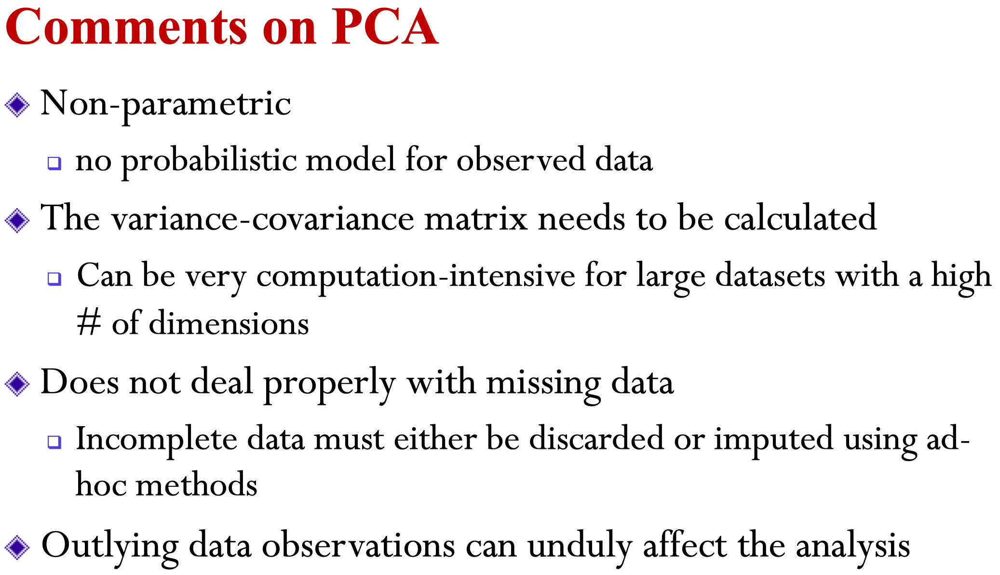
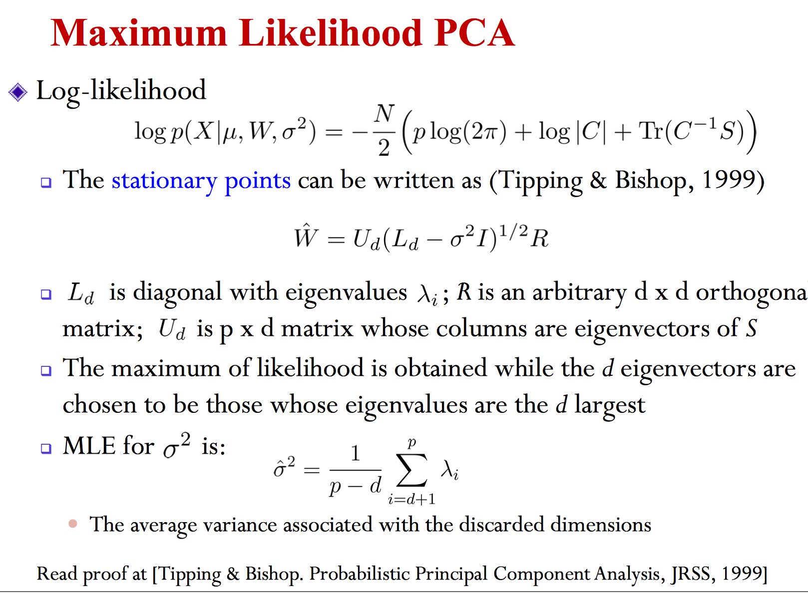

## PCA

### Algorithm


$$
preamble
\newcommand{\vv}[1]{\boldsymbol{#1}}
$$



Given data matrix $\mathbf{X}​$, get the $d​$-largest eigenvalues $\lambda_1, ..., \lambda_d​$ and correbounding egivenvectors $\vv{u}_1, \vv{u}_2, ..., \vv{u}_d​$

let $\mathbf{U}=\begin{bmatrix}\vv u_1, \vv u_2,..., \vv u_d\end{bmatrix}$

Encode: $\mathbf{U}^\top \mathbf X$

Decode: $ \mathbf{U} \mathbf Z$

​	

### Maximum Variance Formulation

#### 1-d case

The projection direction $\vv{u}$ satisfies $||\vv{u}||=1$
$$
y=\vv{u}^\top\vv{x}\\
\bar{\vv{y}}=\vv{u}^\top\bar{\vv{x}}\\
var(\vv{y})=\frac{1}{N}\sum_{i=1}^{N}(\vv u^\top\vv{x}_n-\vv{u}^\top\bar{\vv{x}})^2\\
=\vv{u}^\top \mathbf{S} \vv{u}, \mathbf{S}=\frac{1}{N}(\vv{x}_n-\bar{\vv{x}})(\vv{x}_n-\bar{\vv{x}})^\top
$$

$$
\hat{\vv{u}}=\text{argmax}_\vv{u}\vv{u}^\top \mathbf{S} \vv{u}\\
s.t.\>\> \vv{u}^\top\vv{u}=1
$$

Solve it, we get
$$
\mathbf{S}\vv{u}=\lambda\vv{u}\\
\lambda=\vv{u}^\top \mathbf{S} \vv{u}
$$
Therefore $\lambda$ is the largest eigen-value.

#### add more component

$$
\hat{\vv{u}}_2=\text{argmax}_\vv{u}\vv{u}^\top \mathbf{S} \vv{u}\\
s.t.\>\> \vv{u}^\top\vv{u}=1 \\
\>\> \vv{u}_1^\top\vv{u}=0
$$

$$
\mathbf{S} \vv u_2 - \lambda \vv u_2 - \gamma \vv u_1=0\\
\vv u_1^\top \mathbf{S} \vv u_2 - 0 - \gamma = 0\\
\mathbf{S} \vv u_2 - \lambda \vv u_2=0\\
\lambda=\vv u_2^\top \mathbf{S} \vv u_2
$$

$$
\hat{\vv\mu_3}=\text{argmax}_{\mu_3}\vv\mu_3^\top\mathbf{S}\vv\mu_3\\
s.t. \>\> \vv{\mu_3}^\top\vv\mu_3=1, \vv\mu_3^\top\vv\mu_2=0, \vv\mu_3^\top\vv\mu_1=0,\vv\mu_2^\top\vv\mu_1=0
$$

$$
\mathbf S\vv\mu_3-\lambda \vv\mu_3-\gamma_2\vv\mu_2-\gamma_1\vv\mu_1=0\\
\vv\mu_1^\top\mathbf{S}\vv\mu_3-0-0-\gamma_1=0\\
\vv\mu_2^\top\mathbf{S}\vv\mu_3-0-\gamma_2-0=0\\
\therefore \gamma_1=\gamma_2=0\\
\therefore \mathbf{S}\vv\mu_3=\lambda \vv\mu_3 \\
\therefore \vv\mu_3^\top\mathbf{S}\vv\mu_3=\lambda
$$

Therefore $\vv\mu_2, \vv\mu_3$ must be the eigenvector with 2nd and 3rd largest engienvalues.

### Minimum Error Formulation

A set of complete orthonormal basis
$$
\{\vv u_1,\vv  u_2, ..., \vv u_n\}
$$
Then $\vv x$ can be represented by $\vv{x}=\sum_i \alpha_i \vv u_i, \alpha_i=\vv{x}^\top\vv u_i$

Consider a low-dimension representation:
$$
\vv{x}_n=\sum_{i=1}^{d}z_{ni}\vv u_i + \sum_{i=d+1}^{D}b_i\vv u_i
$$

$$
J=\frac{1}{N}\sum_{n=1}^{N}||x_n-\hat x_n||^2
$$

$$
\frac{dJ}{dz_{ni}}=2(x_n-\sum_{i=1}^dz_{ni}u_i-\sum_{i=d+1}^Db_iu_i)^\top u_i=0\\
x_n^\top u_i -z_{ni}=0
$$

$$
\frac{dJ}{db_i}=2\sum_{n=1}^N(x_n-\sum_{i=1}^dz_{ni}u_i-\sum_{i=d+1}^Db_iu_i)^\top u_i=0\\
\sum_{n=1}^{N}x_n^\top u_i-N b_i=0
$$

Therefore the error $J$ equals
$$
J=\sum_{n=1}^{N}\sum_{i=d+1}^{D}((x_i-\bar x)^\top u_i)u_i\\
=\sum_{i=d+1}^{D}u_i^\top S u_i
$$
It can be prove similarly that $u_i$ should be the $D-d$ smallest eigen-values' eigen-vectors.
$$
\hat x_n = \sum_{i=1}^{d}(x_n^\top u_i + \bar x ^\top u_i - \bar x ^\top u_i)u_i + \sum_{i=d+1}^{D}(\bar x^\top u_i)u_i\\
=\bar x + \sum_{i=1}^{d}(x_n-\bar x)^\top u_i u_i
$$

## Probabilistic PCA

Let $z$ be a latent feature vector. We assume its prior $z\sim N(0, I)$

Assume that $x=Wz+\mu+\epsilon, \epsilon\sim N(0, \sigma^2 I)$

Therefore
$$
p(x|z)=N(x|Wz+\mu, \sigma^2I)\\
p(x)=\int_zp(x|z)p(z)dz=N(x|\mu, C=WW^\top+\sigma^2I)
$$

$$
C^{-1}=\sigma^{-2} I-\sigma^{-2}WM^{-1}W^\top\\
M=W^\top W+\sigma^2I
$$

$$
p(z|x)=\mathcal N(z|M^{-1}W^\top(x-u), \sigma^{-2}M)
$$

Apply MLE on $p(x)$
$$
\nabla_{u}p(x)=\nabla_{u}-\frac{Np}{2}\log(2\pi)-\frac{N}{2}\log|C|-\frac{1}{2}\sum_{n=1}^{N}(x_n-\mu)^\top C^{-1}(x_n-\mu)\\
=C^{-1}\sum_{n=1}^{N}(x_n-\mu)=0\\
\therefore \mu=\bar x
$$

$$
\log p(x)=-\frac{N}{2}(p\log(2\pi)+\log|C|+tr(C^{-1}S))
$$

We can choose $R=I$

Let $\sigma^2\to 0$
$$
\mathbb{E}[z|x]=M^{-1}W^\top(x-\mu)\\
=(W^\top W)^{-1}
$$
