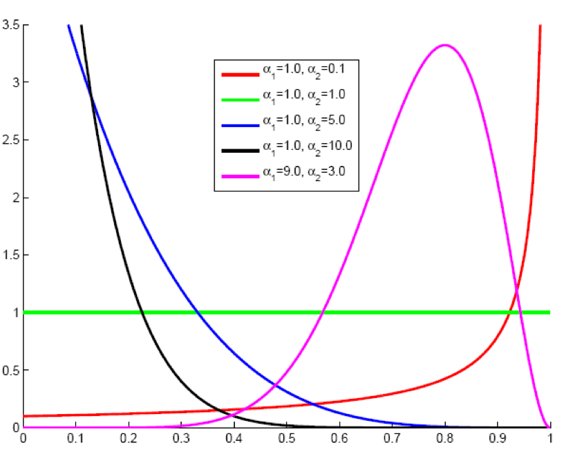
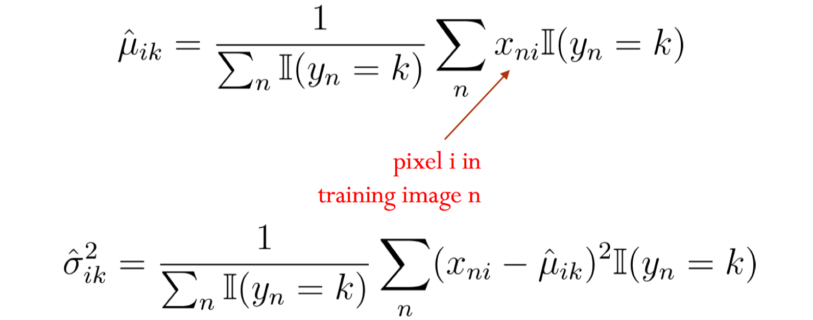

Naive Bayesian and Logistic Regression

<!-- more -->

## NB

### MLE

#### Settings:

$$
p(y|\pi)=\begin{cases}\pi & y=1 \\ 1-\pi & y=0\end{cases} \\
p(x|y, q)=\begin{cases}q_y & x=1 \\ 1-q_y & x=0\end{cases}
$$

Log likelihood:
$$
\mathcal{L} = \log \prod_{i=1}^{N}p(x_i, y_i)\\
=\sum_{i=1}^{N}\log p(x_i|y_i)+\log p(y_i) \\
=\sum_{i=1}^{N}x_i\log q_{y_i} + (1-x_i)\log (1 - q_{y_i}) + y_i\log \pi + (1-y_i)\log (1 - \pi)
$$

#### MLE

$$
\frac{\partial \mathcal{L}}{\partial \pi}=\sum_{i=1}^{N}\frac{1}{\pi}1_{y_i=1}-\frac{1}{1-\pi}1_{y_i=0}\\
=\frac{1}{1-\pi}\sum_{i=1}^{N}\frac{1}{\pi}1_{y_i=1}-1
$$

Therefore $\pi=\frac{N_1}{N}$
$$
\frac{\partial \mathcal{L}}{\partial q_y}=\sum_{i=1}^{N}1_{y_i=y}(\frac{1}{q_y}1_{x_i=1}-\frac{1}{1-q_y}1_{x_i=0})\\
=\frac{1}{1-q_y}\sum_{i=1}^{N}1_{y_i=y}(\frac{1}{q_y}1_{x_i=1}-1)
$$
Therefore $q_y=\frac{N_{y, 1}}{N_y}$

#### Laplace smoothing

$$
\pi=\frac{N_1+\alpha}{N+2\alpha}
$$

### MAP

[Conjugate_prior](https://en.wikipedia.org/wiki/Conjugate_prior)

Use Beta distribution as the prior
$$
p(q_y)=\frac{\Gamma(\alpha_1+\alpha_2)}{\Gamma(\alpha_1)\Gamma(\alpha_2)}q_y^{\alpha_1-1}(1-q_y)^{\alpha_2-1}
$$
Now the log likelihood is:
$$
\mathcal{L} = \log p(q_y) + \log \prod_{i=1}^{N}p(x_i, y_i) \\
=\sum_{i=1}^{N}x_i\log q_{y_i} + (1-x_i)\log (1 - q_{y_i}) + y_i\log \pi + (1-y_i)\log (1 - \pi) \\
+ (\alpha_1-1)\log q_y+ (\alpha_2-1)\log (1-q_y)
$$

$$
\frac{\partial \mathcal{L}}{\partial q_y}=\sum_{i=1}^{N}1_{y_i=y}(\frac{1}{q_y}1_{x_i=1}-\frac{1}{1-q_y}1_{x_i=0})\\
+ (\alpha_1-1)\frac{1}{q_y} - (\alpha_2-1)\frac{1}{1-q_y}\\
=\frac{1}{1-q_y}\sum_{i=1}^{N}1_{y_i=y}(\frac{1}{q_y}1_{x_i=1}-1)+ (\alpha_1-1)\frac{1}{q_y} - (\alpha_2-1)\frac{1}{1-q_y} \\
=\frac{1}{1-q_y}(\frac{1}{q_y}N_{y,1}-N_y-\alpha_2+1)+(\alpha_1-1)\frac{1}{q_y} \\
\therefore q_y=\frac{N_{y,1}+\alpha_1-1}{N+\alpha_1+\alpha_2-2}
$$

#### Beyesian Regression

$$
\newcommand{\vv}[1]{\boldsymbol{#1}}
y=f(\vv{x})+\epsilon, \epsilon \sim \mathcal{N}(0, \sigma^2)
$$

$$
p(\vv{y}|\mathbf{X}, \vv{w})=\prod_{i=1}^{N}p(y_i|\vv{x_i}, \vv{w})=N(X^\top\vv{w}, \sigma^2\mathbf{I})
$$

Prior is Gaussian
$$
p(\vv{w})=\mathcal{N}(\mathbf{0}, \mathbf{\Sigma})
$$
Since the posterior is Gaussian, we only need to determine the mean and covariance.
$$
\text{let } p(\vv{w}|\mathbf{X},\vv{y})=\mathcal{N}(\vv\mu, \mathbf{\Sigma_1})\\
-\frac{1}{2}\sigma^{-2}(\vv{y}^\top\vv{y}-2\vv{y}^\top\mathbf{X}^\top\vv{w}+\vv{w}^\top\mathbf{X}\mathbf{X}^\top\vv{w}+\vv{w}^\top\mathbf{\Sigma}^{-1}\vv{w}) \\
\therefore \mathbf{\Sigma_1}=\mathbf{A}^{-1}, \mathbf{A}=\sigma^{-2}\mathbf{X}\mathbf{X}^\top+\mathbf{\Sigma}^{-1}\\
\therefore \vv{\mu}^\top \mathbf{A}=\sigma^{-2}\vv{y}^\top\mathbf{X}^\top\\
\therefore \vv{\mu}=\sigma^{-2} \mathbf{A}^{-1}\mathbf{X}\vv{y}
$$
### Generalized NB

applied to continious features
$$
Y\sim\text{Bernoulli}(\pi)\\
P(X|Y)=\mathcal{N}(\mu_{Y}, \sigma_{Y}^2)
$$
The MLE estimated mean and variance is the sample mean variance on those samples with corresponding $Y$.

### Decision Boundary of NB

NB's decisiion boundary depends on its distribution assumptions.

for GNB with equal variance:
$$
\log \frac{\prod_{i=1}^{n}}{}=0
$$

## Linear Regression

### From NB to LR

