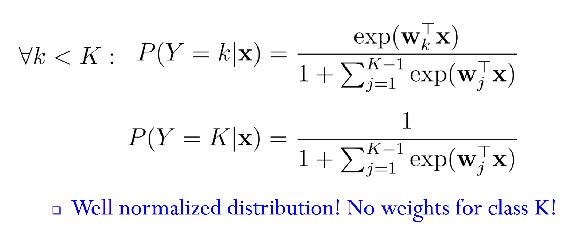
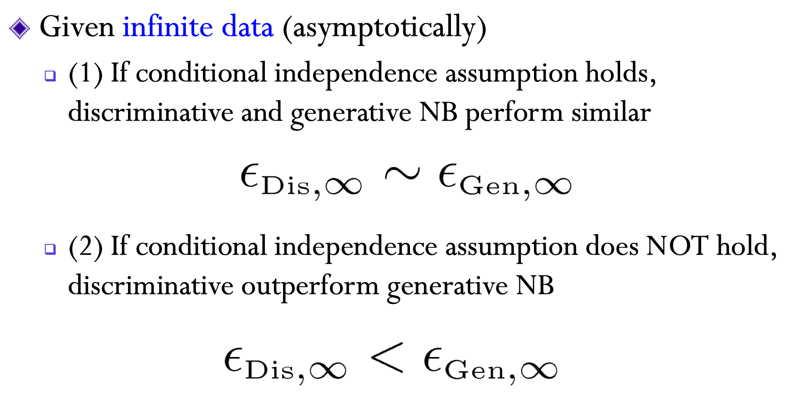
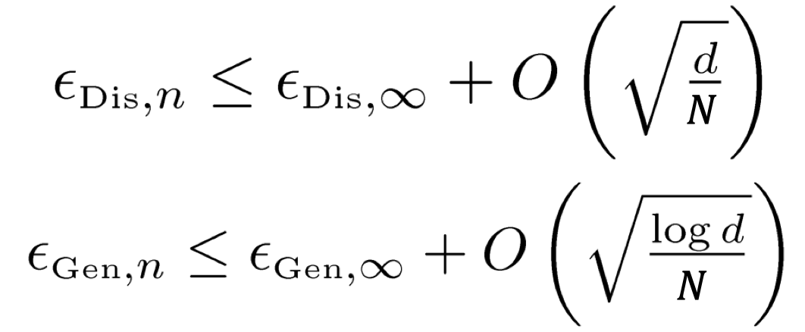

Naive Bayesian and Logistic Regression

<!-- more -->

## NB

### MLE

#### Settings:

$$
p(y|\pi)=\begin{cases}\pi & y=1 \\ 1-\pi & y=0\end{cases} \\
p(x|y, q)=\begin{cases}q_y & x=1 \\ 1-q_y & x=0\end{cases}
$$

Log likelihood:
$$
\mathcal{L} = \log \prod_{i=1}^{N}p(x_i, y_i)\\
=\sum_{i=1}^{N}\log p(x_i|y_i)+\log p(y_i) \\
=\sum_{i=1}^{N}x_i\log q_{y_i} + (1-x_i)\log (1 - q_{y_i}) + y_i\log \pi + (1-y_i)\log (1 - \pi)
$$

#### MLE

$$
\frac{\partial \mathcal{L}}{\partial \pi}=\sum_{i=1}^{N}\frac{1}{\pi}1_{y_i=1}-\frac{1}{1-\pi}1_{y_i=0}\\
=\frac{1}{1-\pi}\sum_{i=1}^{N}\frac{1}{\pi}1_{y_i=1}-1
$$

Therefore $\pi=\frac{N_1}{N}$
$$
\frac{\partial \mathcal{L}}{\partial q_y}=\sum_{i=1}^{N}1_{y_i=y}(\frac{1}{q_y}1_{x_i=1}-\frac{1}{1-q_y}1_{x_i=0})\\
=\frac{1}{1-q_y}\sum_{i=1}^{N}1_{y_i=y}(\frac{1}{q_y}1_{x_i=1}-1)
$$
Therefore $q_y=\frac{N_{y, 1}}{N_y}$

#### Laplace smoothing

$$
\pi=\frac{N_1+\alpha}{N+2\alpha}
$$

### MAP

[Conjugate_prior](https://en.wikipedia.org/wiki/Conjugate_prior)

Use Beta distribution as the prior
$$
p(q_y)=\frac{\Gamma(\alpha_1+\alpha_2)}{\Gamma(\alpha_1)\Gamma(\alpha_2)}q_y^{\alpha_1-1}(1-q_y)^{\alpha_2-1}
$$
Now the log likelihood is:
$$
\mathcal{L} = \log p(q_y) + \log \prod_{i=1}^{N}p(x_i, y_i) \\
=\sum_{i=1}^{N}x_i\log q_{y_i} + (1-x_i)\log (1 - q_{y_i}) + y_i\log \pi + (1-y_i)\log (1 - \pi) \\
+ (\alpha_1-1)\log q_y+ (\alpha_2-1)\log (1-q_y)
$$

$$
\frac{\partial \mathcal{L}}{\partial q_y}=\sum_{i=1}^{N}1_{y_i=y}(\frac{1}{q_y}1_{x_i=1}-\frac{1}{1-q_y}1_{x_i=0})\\
+ (\alpha_1-1)\frac{1}{q_y} - (\alpha_2-1)\frac{1}{1-q_y}\\
=\frac{1}{1-q_y}\sum_{i=1}^{N}1_{y_i=y}(\frac{1}{q_y}1_{x_i=1}-1)+ (\alpha_1-1)\frac{1}{q_y} - (\alpha_2-1)\frac{1}{1-q_y} \\
=\frac{1}{1-q_y}(\frac{1}{q_y}N_{y,1}-N_y-\alpha_2+1)+(\alpha_1-1)\frac{1}{q_y} \\
\therefore q_y=\frac{N_{y,1}+\alpha_1-1}{N+\alpha_1+\alpha_2-2}
$$

#### Beyesian Regression

\
$$
\newcommand{\vv}[1]{\boldsymbol{#1}}
y=f(\vv{x})+\epsilon, \epsilon \sim \mathcal{N}(0, \sigma^2)
$$

$$
p(\vv{y}|\mathbf{X}, \vv{w})=\prod_{i=1}^{N}p(y_i|\vv{x_i}, \vv{w})=N(X^\top\vv{w}, \sigma^2\mathbf{I})
$$



Prior is Gaussian
$$
p(\vv{w})=\mathcal{N}(\mathbf{0}, \mathbf{\Sigma})
$$
Since the posterior is Gaussian, we only need to determine the mean and covariance.
$$
\text{let } p(\vv{w}|\mathbf{X},\vv{y})=\mathcal{N}(\vv\mu, \mathbf{\Sigma_1})\\
-\frac{1}{2}\sigma^{-2}(\vv{y}^\top\vv{y}-2\vv{y}^\top\mathbf{X}^\top\vv{w}+\vv{w}^\top\mathbf{X}\mathbf{X}^\top\vv{w}+\vv{w}^\top\mathbf{\Sigma}^{-1}\vv{w}) \\
\therefore \mathbf{\Sigma_1}=\mathbf{A}^{-1}, \mathbf{A}=\sigma^{-2}\mathbf{X}\mathbf{X}^\top+\mathbf{\Sigma}^{-1}\\
\therefore \vv{\mu}^\top \mathbf{A}=\sigma^{-2}\vv{y}^\top\mathbf{X}^\top\\
\therefore \vv{\mu}=\sigma^{-2} \mathbf{A}^{-1}\mathbf{X}\vv{y}
$$
### Generalized NB

applied to continious features
$$
Y\sim\text{Bernoulli}(\pi)\\
P(X|Y)=\mathcal{N}(\mu_{Y}, \sigma_{Y}^2)
$$
The MLE estimated mean and variance is the sample mean variance on those samples with corresponding $Y$.

### Decision Boundary of NB

NB's decisiion boundary depends on its distribution assumptions.

for GNB with equal variance:
$$
\log \frac{\prod_{i=1}^{d}P(X_i|Y_i=0)P(Y_i=0)}{\prod_{i=1}^{d}P(X_i|Y_i=1)P(Y_i=1)}=0 \\
\log \frac{1-\pi}{\pi}+\sum_i \frac{\mu_{i1}^2-\mu_{i0}^2}{\sigma_i^2}+\sum_i\frac{\mu_{i0}-\mu_{i1}}{\sigma_i^2}x_i = 0
$$
therefore the decision boundary is linear

But if the variances are not equal, it is not linear.

## Linear Regression

### From NB to LR

$$
P(y=1|\vv{x})=\frac{p(y=1, \vv{x})}{p(y=1, \vv{x}) + p(y=0, \vv{x})} \\
=\frac{1}{1+\frac{p(y=0, \vv{x})}{p(y=1, \vv{x})}} \\
=\frac{1}{1+\exp(-\vv{w}^\top\vv{x}-b)}
$$

#### sigmoid function

$$
\sigma(x)=\frac{1}{1+\exp(-x)}\\
\frac{d\sigma}{dx}=\sigma(x)(1-\sigma(x)) \\
1-\sigma(x)=\sigma(-x)
$$

#### Multiclass LR

decision boundary is not linear, it is piecewise linear

### Maximum Conditional Likelihood Estimate

MLE is $\max P(X, Y)$, but we don't have it in LR.

In MCLE, we do $\max P(Y|X)$

#### It is a Convex Problem

$$
\mathcal{L}(\vv{w})=\sum_{i=1}^{N}\log p(y_i|\vv{x}_i, \vv{w})\\
=\sum_{i=1}^{N}y_i\vv{w}^\top\vv{x}_i-\log(1+\exp(\vv{w}^\top\vv{x}_i))
$$

#### Gradient Descent

$$
\frac{\partial \mathcal{L}}{\partial \vv{w}}=\sum_{i=1}^{N}\vv{x}_i(y_i-u_i)\\
u_i=p(y_i=1|\vv{x}_i, \vv{w})=\sigma(-\vv{w}^\top\vv{x})
$$

$$
\vv{w}_{t+1}\leftarrow \vv{w}_t + \frac{\partial \mathcal{L}}{\partial \vv{w}}
$$

#### Newton Method

$$
\vv{w}_{t+1}\leftarrow \vv{w}_t - \mathbf{H}^{-1}\frac{\partial \mathcal{L}}{\partial \vv{w}}\\
\mathbf{H} = \frac{\partial^2 \mathcal{L}}{\partial\vv{w}\partial\vv{w}}
$$

#### IRLS

$$
\nabla_\vv{w}\mathcal{L}=\sum_{i=1}^{N}\vv{x}_i(y_i-u_i)=\mathbf{X}(\vv{y}-\vv{u})\\
\mathbf{H}=\nabla^2_\vv{w}\mathcal{L}=\sum_{i=1}^{N}-\vv{x}_iu_i(1-u_i)\vv{x}_i^\top=-\mathbf{X}\mathbf{R}\mathbf{X}^\top \\
\mathbf{R}_{ii}=u_i(1-u_i)
$$

For least square of linear regression, we have
$$
\vv{w}=(\mathbf{X}\mathbf{X}^\top)^{-1}\mathbf{X}\vv{y}
$$
IRLS:
$$
\vv{w}_{t+1}\leftarrow\vv{w}_t - \mathbf{H}^{-1}\nabla_\vv{w}\mathcal{L}\\
=\vv{w}_t-(\mathbf{X}\mathbf{R}\mathbf{X}^\top)^{-1}\mathbf{X}(\vv{u}-\vv{y})\\
=(\mathbf{X}\mathbf{R}\mathbf{X}^\top)^{-1}(\mathbf{X}\mathbf{R}\mathbf{X}^\top\vv{w}_t - \mathbf{X}(\vv{u}-\vv{y}))\\
=(\mathbf{X}\mathbf{R}\mathbf{X}^\top)^{-1}\mathbf{X}\mathbf{R}(\mathbf{X}^\top\vv{w}_t - \mathbf{R}^{-1}(\vv{u}-\vv{y}))
$$

## Generative v.s. Discrimitive

Genrative model has assumptions on $P(X|Y)$, discrimitive models has assumptions on $P(Y|X)$.

## Exponential Family

### General Form

$$
p(\vv{x}|\vv{\eta})=h(\vv{x})g(\vv{\eta})\exp(\vv\eta^\top\vv u(\vv{x}))
$$

$g(\vv\eta)$ is the normalization coefficient.

#### Bernoulli

$$
p(x|\mu)=\mu^{x}(1-\mu)^{1-x} \\
=\exp(x\log\mu+(1-x)\log(1-\mu)) \\
=(1-\mu)\exp(\log\frac{\mu}{1-\mu}x)\\
= \sigma(-\eta)\exp(\eta x)
$$

$$
\eta=\log\frac{\mu}{1-\mu}\\
h(x)=1\\
g(\eta)=\sigma(-\eta)\\
u(x)=x
$$

#### Multinominal

$$
p(\vv{x}|\vv{\mu})=\prod_{k=1}^{M}\mu_k^{x_k}\\
=\exp(\sum x_k\log \mu_k) \\
=\exp(\sum_{i=1}^{M-1}x_k\log \mu_k+(1-\sum_{i=1}^{M-1}x_k)\log(1-\sum_{k=1}^{M-1}\mu_k))\\
=(1-\sum_{i=1}^{M-1}\mu_k)\exp(\sum_{k=1}^{M-1}x_k\log(\frac{\mu_k}{1-\sum_{k=1}^{M-1}\mu_k}))\\
=\frac{(1-\sum_{k=1}^{M-1}\mu_k)}{\mu_M}\exp(\sum_{k=1}^{M}x_k\log\mu_k) \\
=\exp(\sum_{k=1}^{M}x_k\log\mu_k)
$$

$$
\vv\eta=(\log \mu_1, \log \mu_2, ..., \log\mu_M)^\top \\
\vv u(\vv{x})=\vv{x}\\
h(\vv{x})=1\\
g(\eta)=1
$$

#### Multivariate Gaussian

$$
p(\vv{x}|\vv\mu, \mathbf{\Sigma})=\frac{1}{(2\pi)^\frac{d}{2}|\Sigma|^\frac{1}{2}}\exp(-\frac{1}{2}(\vv x - \vv\mu)^\top\Sigma^{-1}(\vv x - \vv\mu))\\
=\frac{1}{(2\pi)^\frac{d}{2}|\Sigma|^\frac{1}{2}}\exp(-\frac{1}{2}\text{tr}(\Sigma^{-1}\vv{x}\vv{x}^\top)+\vv\mu^\top\Sigma^{-1}\vv{x}-\frac{1}{2}\vv\mu^\top\Sigma^{-1}\vv\mu)\\
$$

then
$$
\vv{\eta}=\begin{bmatrix}\Sigma^{-1}\vv{\mu}, -\frac{1}{2}\text{vec}(\Sigma^{-1}) \end{bmatrix} \\
=[\vv\eta_1, \text{vec}(\vv{\eta}_2)]\\
\vv{u}(\vv{x})=\begin{bmatrix}\vv{x}, \text{vec}(\vv{x}\vv{x}^\top)\end{bmatrix}
$$

$$
g(\vv{\eta})=|\Sigma|^{-\frac{1}{2}}\exp(-\frac{1}{2}\vv\mu^\top\Sigma^{-1}\vv{\mu})\\
=|-2\vv{\eta}_2|^{\frac{1}{2}}\exp(\vv\eta_1\vv\eta_1^\top)
$$

