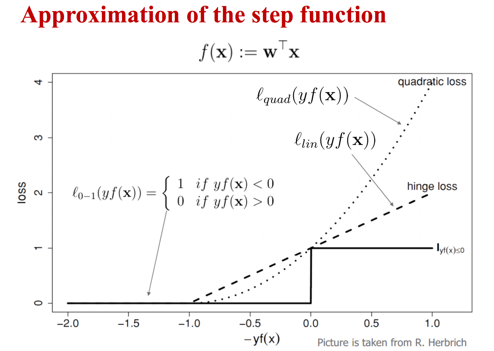

SVM

<!-- more -->

## SVM: Max Margin and Dual Problem

The basic idea of SVM is max margin: maximize the closest distance of each class to hy classification hyperplane.

Let the trainning set 
$$
\{\boldsymbol{x}_i, y_i\}_{i=1}^{N}, \boldsymbol x_i \in \mathbb{R}^d, y_i \in \{-1, 1\}
$$
 be separated by a hyperplane with the margin $\rho$.

Then
$$
\forall i = 1,2,...,N, y_i(\boldsymbol{w}^\top\boldsymbol x_i+b) \ge \frac{\rho}{2}
$$

where $\mathbf{w}​$ is the unit normal vector of the hyperplane.

Then we rescale the hyperplane with $\frac{\rho}{2}​$
$$
\forall i = 1,2,...,N, y_i(\boldsymbol{w}^\top\boldsymbol x_i+b) \ge 1
$$
For support vectors $\boldsymbol{x}_s$the above inequality is equality.

So now the margin is 
$$
\rho = 2r=2 \frac{|\boldsymbol{w}^\top\boldsymbol x_s+b|}{||\boldsymbol{w}||}=\frac{2}{||\boldsymbol{w}||}
$$

Now we get the primal problem:
$$
\min \frac{1}{2}||\boldsymbol{w}||^2 \\
s.t.\>\>\>\> y_i(\boldsymbol{w}^\top\boldsymbol{x}_i +b)\ge1, \forall i = 1,2,...,N
$$

The predict function is
$$
\hat y = f(\boldsymbol x)=\text{sign}(\boldsymbol{w}^\top \boldsymbol x + b)
$$

Lagrangian function:
$$
L(\boldsymbol{w}, b, \boldsymbol\alpha) = \frac{1}{2}||\boldsymbol{w}||^2 - \sum_{i=1}^{N}\alpha_i (y_i(\boldsymbol{w}^\top\boldsymbol x_i+b) - 1), \boldsymbol \alpha \ge 0
$$
The primal problem is $\min_\boldsymbol{w, b} \max_{\boldsymbol \alpha \ge 0} L(\boldsymbol{w}, b, \boldsymbol \alpha)$

Then the dual problem is $\max_{\boldsymbol \alpha \ge 0} \min_{\boldsymbol{w},b}L(\boldsymbol{w},b,\boldsymbol \alpha)​$

To minimize with parameter $\boldsymbol{w}$ and $b$, their deriative should be zeros:
$$
\frac{\partial L}{\partial \boldsymbol{w}}=\boldsymbol{w}-\sum_{i=1}^{N}\alpha_i y_i\boldsymbol x_i \\
\frac{\partial L}{\partial b} = -\sum_{i=1}^{N}\alpha_iy_i
$$
Therefore:
$$
\boldsymbol{w}^*=\sum_{i=1}^{N}\alpha_iy_i\boldsymbol x_i\\
\sum_{i=1}^{N}\alpha_iy_i=0
$$
Then substitute $\boldsymbol{w}$:
$$
L(\boldsymbol \alpha, b)=\frac{1}{2}||\sum_{i=1}^{N}\alpha_iy_i\boldsymbol x_i||^2-\sum_{i=1}^{N}[\alpha_iy_i\sum_{j=1}^N\alpha_jy_j\boldsymbol x_j^\top \boldsymbol x_i+\alpha_iy_ib] \\
=\boldsymbol \alpha^\top \boldsymbol 1 - \frac{1}{2}\boldsymbol \alpha^\top\mathbf{Y}\mathbf{G}\mathbf{Y}\boldsymbol \alpha - b \sum_{i=1}^{N}\alpha_iy_i \\
=\boldsymbol \alpha^\top \boldsymbol 1 - \frac{1}{2}\boldsymbol \alpha^\top\mathbf{Y}\mathbf{G}\mathbf{Y}\boldsymbol \alpha
$$

Now we get the dual problem:
$$
\max \boldsymbol \alpha^\top \boldsymbol 1 - \frac{1}{2}\boldsymbol \alpha^\top\mathbf{Y}\mathbf{G}\mathbf{Y}\boldsymbol \alpha \\
s.t.\>\>\>\>\boldsymbol \alpha\ge0
$$

In order to place the hyperplane in the middle of two classes:
$$
b=-\frac{\max_{i:y_i=-1}\boldsymbol{w}^\top\boldsymbol x_i + \min_{i:y_i=+1}\boldsymbol{w}^\top\boldsymbol x_i}{2}
$$
Accoding to the complement slackness condition:
$$
\alpha_i(y_i(\boldsymbol{w}^\top\boldsymbol x_i+b) - 1)=0
$$
So only support vectors matter.

## Soft SVM

What if the problem is not linear-seperatable?

The hard SVM primal problem can be rewritten as follows:
$$
\min \frac{1}{2}||\boldsymbol{w}||^2+\sum_{i=1}^{N}l_{0-\infty}(y_i(\boldsymbol{w}^\top\boldsymbol x_i + b) - 1) \\
l_{0-\infty}(x)=\begin{cases}0&x\ge0\\\infty&x<0\end{cases}
$$

Try to tolerate:
$$
\min \frac{1}{2}||\boldsymbol{w}||^2+\sum_{i=1}^{N}l_{0-1}(y_i(\boldsymbol{w}^\top\boldsymbol x_i + b) - 1) \\
l_{0-1}(x)=\begin{cases}0&x\ge0\\1&x<0\end{cases}
$$

But this problem is not convex.

{ width=100% }

Hinge loss upper bounds the 0-1 loss.
$$
l_{lin}(x)=\max(0, x+1)
$$

Take hinge loss as an example to solve soft SVM.

Now the problem is
$$
\min \frac{1}{2}||\boldsymbol{w}||^2+\sum_{i=1}^{N}l_{lin}(y_i(\boldsymbol{w}^\top\boldsymbol x_i + b)) \\
l_{lin}(x)=\max(0, 1-x)
$$

Rewrite this problem, and rescale the loss by $C$:
$$
\min \frac{1}{2}||\boldsymbol{w}||^2+C\sum_{i=1}^{N}\xi_i\\
s.t. \>\>\>\> y_i(\boldsymbol{w}^\top\boldsymbol x_i+b) \ge 1-\xi_i,\forall i=1,2,...,N\\
\boldsymbol \xi \ge \boldsymbol 0
$$

The Lagrangian function is:
$$
L(\boldsymbol{w}, \boldsymbol \xi, \boldsymbol \alpha, \boldsymbol \beta)= \frac{1}{2}||\boldsymbol{w}||^2+C\sum_{i=1}^{N}\xi_i - \sum_{i=1}^{N}\alpha_i(y_i(\boldsymbol{w}^\top\boldsymbol x_i+b) - 1 + \xi_i) - \sum_{i=1}^{N}\beta_i\xi_i
$$
Minimize $\mathbf{w}$ and $\boldsymbol \xi$:
$$
\frac{\partial L}{\partial \boldsymbol{w}}=\boldsymbol{w}-\sum_{i=1}^{N}\alpha_iy_i\boldsymbol x_i \\
\frac{\partial L}{\partial \boldsymbol \xi}=C \boldsymbol 1 - \boldsymbol \alpha - \boldsymbol \beta
$$
Therefore
$$
\boldsymbol \beta = C \boldsymbol 1 - \boldsymbol \alpha \ge \boldsymbol 0\\
\boldsymbol w = \sum_{i=1}^{N}\alpha_iy_i\boldsymbol x_i
$$
Then we get the dual problem:
$$
\max \boldsymbol \alpha^\top \boldsymbol 1 - \frac{1}{2}\boldsymbol \alpha^\top\mathbf{Y}\mathbf{G}\mathbf{Y}\boldsymbol \alpha \\
s.t.\>\>\>\>C\boldsymbol 1\ge\boldsymbol\alpha\ge\boldsymbol0
$$

## Kernel

$$
\mathbf{G}=(\boldsymbol x_i^\top \boldsymbol x_j)_{N\times N}
$$

