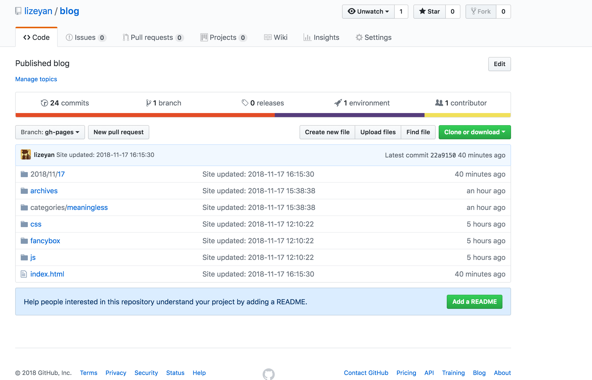

# This is a title

## 插入图片

``` bash
npm install https://github.com/7ym0n/hexo-asset-image --sa
vim node_modules/hexo-asset-image/index.js
```

``` javascript
var link = data.permalink;
if(version.length > 0 && Number(version[0]) == 3)
    var beginPos = getPosition(link, '/', 4) + 1;
else
    var beginPos = getPosition(link, '/', 3) + 1;
// In hexo 3.1.1, the permalink of "about" page is like ".../about/index.html".
var endPos = link.lastIndexOf('/') + 1;
```

## 数学公式

[https://nathaniel.blog/tutorials/make-hexo-support-math-again/](https://nathaniel.blog/tutorials/make-hexo-support-math-again/)

## Math Formulation


$$
\int_\mathbb{R}\mu(dx)
$$


## Code

``` python
import pandas as pd
df = pd.read_csv(path)
```

### Image test

